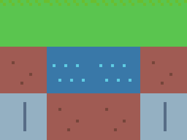

# Aseprite MCP

[](https://github.com/MalloyTheDev/aseprite-mcp/actions/workflows/ci.yml)
[](LICENSE)
[](https://www.python.org/)
[](https://modelcontextprotocol.io)

<p align="center">
  
  &nbsp;&nbsp;&nbsp;
  
</p>
<p align="center">
  <sub>This slime was drawn, shaded, outlined, and animated <strong>entirely through MCP tool calls</strong> — no manual pixel-pushing.</sub>
</p>

An extensive [Model Context Protocol](https://modelcontextprotocol.io) server that lets an
AI agent (Claude Code, Claude Desktop, or any MCP client) **create and edit
[Aseprite](https://www.aseprite.org/) sprites** — draw pixel art, build animations,
manage layers/frames/tags/palettes, and export to PNG/GIF/sprite sheets — all headlessly.

📖 **Full tool reference:** [`docs/TOOLS.md`](docs/TOOLS.md) — every tool with its parameters.

It works by generating **Lua scripts** and running them through Aseprite's batch mode
(`aseprite -b --script ...`), plus the Aseprite CLI for exports. Every operation opens a
real `.aseprite` file, edits it, and saves — so your files stay fully editable in the
Aseprite GUI.

- **99 tools** across sprites, layers, frames, cels, drawing (incl. pixel-perfect &
  anti-aliased modes), custom brushes & symmetry, palettes (extract/sort/ramps), animation
  tags, slices/9-patch, effects (gradients/outline/drop-shadow/colour adjustments), text
  rendering, tilemaps, image stamping, reference/rotoscope layers, transforms, rich
  export (per-layer/per-tag, sprite sheets, onion-skin), a GUI companion view, and a
  `health_check` self-test.
- **Sandboxed file access** — by default the file capability is scoped to the workspace
  (relative paths only; absolute/`..` paths rejected unless you opt in).
- **Structured results** — every tool returns JSON describing the updated sprite.
- **`render_preview`** returns a PNG so the agent can *see* its work and self-correct.
- **Deterministic, stateless, robust** — each call is an isolated, headless Aseprite run.

---

## Showcase

Everything below was produced **entirely through MCP tool calls** — no manual pixel-pushing —
exercising drawing, shading, outlines, animation, tilemaps, and palette generation.

<p align="center">
  
  &nbsp;&nbsp;&nbsp;&nbsp;
  
</p>
<p align="center">
  <sub>A skeleton character, and a tilemap scene built from 4 painted tiles (grass, dirt, water, stone).</sub>
</p>
<p align="center">
  
  <br>
  <sub><code>generate_ramp</code> — a hue-shifted shading ramp (cool shadows → warm highlights) from one base colour.</sub>
</p>

---

## Requirements

- **Aseprite 1.3+** (the scripting API). The Steam and standalone builds both work.
- **Python 3.10+**
- **[uv](https://docs.astral.sh/uv/)** (recommended) — or any PEP 517 installer.

## Install

```bash
git clone https://github.com/MalloyTheDev/aseprite-mcp.git
cd aseprite-mcp
uv sync
```

That creates a virtual environment and installs the `aseprite-mcp` package and its
dependencies. Verify it can find Aseprite and run the test suite (tests auto-skip if
Aseprite isn't found):

```bash
uv run pytest
```

## Configuration

Everything is configurable via environment variables (all optional):

| Variable | Purpose | Default |
| --- | --- | --- |
| `ASEPRITE_PATH` | Full path to `Aseprite.exe` / `aseprite`. | Auto-detected (Steam, standalone, PATH). |
| `ASEPRITE_MCP_WORKSPACE` | Folder where **relative** sprite paths are resolved. | `<repo>/workspace` |
| `ASEPRITE_MCP_TIMEOUT` | Per-operation timeout in seconds. | `90` |
| `ASEPRITE_MCP_ALLOW_ABSOLUTE` | Allow absolute / workspace-escaping paths (`1`/`true` to enable). | off (sandboxed) |

On this machine Aseprite was detected at
`C:\Program Files (x86)\Steam\steamapps\common\Aseprite\Aseprite.exe`, so `ASEPRITE_PATH`
is not strictly required — but setting it explicitly is the most reliable.

---

## Register with an MCP client

Replace `/ABSOLUTE/PATH/TO/aseprite-mcp` below with the absolute path to your clone.

### Claude Code (CLI)

```bash
claude mcp add aseprite -- uv --directory /ABSOLUTE/PATH/TO/aseprite-mcp run aseprite-mcp
```

To set the Aseprite path explicitly (recommended if auto-detection fails):

```bash
claude mcp add aseprite \
  --env ASEPRITE_PATH="/path/to/Aseprite.exe" \
  -- uv --directory /ABSOLUTE/PATH/TO/aseprite-mcp run aseprite-mcp
```

### Claude Desktop / generic MCP client (JSON)

Add this to your client's MCP server config (e.g. `claude_desktop_config.json`). A
ready-to-copy template lives in [`mcp-config.example.json`](mcp-config.example.json)
(Windows-style paths shown — adjust for your OS):

```json
{
  "mcpServers": {
    "aseprite": {
      "command": "uv",
      "args": ["--directory", "C:\\path\\to\\aseprite-mcp", "run", "aseprite-mcp"],
      "env": {
        "ASEPRITE_PATH": "C:\\Program Files (x86)\\Steam\\steamapps\\common\\Aseprite\\Aseprite.exe",
        "ASEPRITE_MCP_WORKSPACE": "C:\\path\\to\\aseprite-mcp\\workspace"
      }
    }
  }
}
```

Restart the client; the `aseprite` server and its 99 tools will be available. Ask the
agent to run `health_check` to confirm Aseprite is wired up correctly.

---

## Tool catalogue

Relative filenames resolve inside the workspace (absolute paths require
`ASEPRITE_MCP_ALLOW_ABSOLUTE=1` — see [Security](#security)).
Frames and palette-aware operations are **1-based** for frames, **0-based** for palette
indices. Colours accept `#RRGGBB`, `#RRGGBBAA`, `r,g,b`, `r,g,b,a`, `index:N`, or a name
(`black`, `white`, `red`, `green`, `blue`, `yellow`, `cyan`, `magenta`, `transparent`, …).

### Sprite lifecycle
| Tool | Description |
| --- | --- |
| `create_sprite` | Create & save a new sprite (`rgb`/`indexed`/`gray`, optional background). |
| `save_sprite_as` | Save a copy under a new path (optionally flattened). |
| `set_color_mode` | Convert between `rgb` / `indexed` / `gray` (with dithering). |
| `resize_canvas` | Change canvas size without scaling art (`top_left` / `center`). |
| `crop_sprite` | Crop the canvas to a rectangle. |
| `scale_sprite` | Scale the whole sprite (by factor or to dimensions; `nearest`/`bilinear`). |
| `flatten_sprite` | Flatten all layers into one. |
| `trim_sprite` | Auto-crop the canvas to non-transparent content. |
| `convert_layer_to_background` · `convert_background_to_layer` | Toggle the opaque Background layer. |

### Inspection & preview
| Tool | Description |
| --- | --- |
| `get_sprite_info` | Full structured state: size, mode, frames, layer tree, tags, palette. |
| `render_preview` | Render a frame to a PNG image you can view (scaled). |
| `get_pixels` | Read composited pixel colours of a region (≤ 64×64 per call). |
| `list_sprites` | List sprite/image files in the workspace. |

### Layers
| Tool | Description |
| --- | --- |
| `add_layer` | Add a layer (optional group, opacity, blend mode, visibility). |
| `add_group_layer` | Add a group layer. |
| `remove_layer` · `rename_layer` | Delete / rename a layer. |
| `set_layer_properties` | Update opacity, blend mode, visibility, editability, name. |
| `move_layer` | Reorder a layer (1-based stack index, 1 = bottom). |
| `duplicate_layer` · `merge_layer_down` | Duplicate / merge a layer down. |

### Frames (animation)
| Tool | Description |
| --- | --- |
| `add_frame` | Append a frame (empty, or a copy of another). |
| `duplicate_frame` · `remove_frame` | Duplicate / delete a frame. |
| `set_frame_duration` · `set_all_frame_durations` | Set per-frame / uniform durations (ms). |

### Cels (a layer's image at a frame)
| Tool | Description |
| --- | --- |
| `get_cel` | Inspect a cel (exists, position, bounds, opacity). |
| `set_cel_position` · `set_cel_opacity` | Move / fade a cel. |
| `copy_cel` · `delete_cel` | Copy a cel between frames / delete it. |

### Animation tags
| Tool | Description |
| --- | --- |
| `add_tag` | Tag a frame range with a name, direction, colour. |
| `set_tag` · `remove_tag` | Edit / delete a tag. |

### Drawing
| Tool | Description |
| --- | --- |
| `draw_pixels` | Plot individual pixels (per-pixel or shared colour). |
| `draw_line` · `draw_polyline` | Line / connected segments; `pixel_perfect` & `antialias` options. |
| `draw_curve` | Quadratic Bézier curve. |
| `draw_rectangle` · `draw_ellipse` | Outline or filled rectangle / ellipse; ellipse has `antialias`. |
| `fill_area` | Flood fill (paint bucket) from a point. |
| `fill_layer` · `clear_layer` | Fill the whole cel / erase it to transparent. |

### Brushes & symmetry
| Tool | Description |
| --- | --- |
| `draw_brush` | Stamp a custom brush shape (ASCII mask) at many points. |
| `stamp_pattern` | Tile an image/sprite across a region (with spacing, opacity, blend). |
| `mirror_layer` | Reflect one half of a layer onto the other (build symmetric art). |
| `draw_symmetric_pixels` | Plot pixels with horizontal/vertical/4-way mirroring. |

### Slices (named regions / 9-patch)
| Tool | Description |
| --- | --- |
| `add_slice` · `set_slice` · `remove_slice` · `list_slices` | Manage slices with optional 9-patch center, pivot, colour, and data. |

### Effects & colour adjustments
| Tool | Description |
| --- | --- |
| `fill_gradient` | Linear/radial gradient, multi-stop, optional Bayer dithering. |
| `fill_checkerboard` | Two-colour checkerboard pattern. |
| `add_outline` | Pixel outline around art (outside/inside, 4/8-connectivity, thickness). |
| `add_drop_shadow` | Hard drop shadow on a new layer beneath the art. |
| `replace_color` | Swap a colour (with per-channel tolerance). |
| `invert_colors` | Invert RGB (alpha preserved). |
| `adjust_brightness_contrast` · `adjust_hue_saturation` · `desaturate` | Colour grading. |

### Text
| Tool | Description |
| --- | --- |
| `draw_text` | Render text (built-in bitmap font or a TrueType file) as crisp pixels. |

### Tilemaps (Aseprite 1.3+)
| Tool | Description |
| --- | --- |
| `create_tilemap_layer` | Create a tilemap layer with a tile size + empty grid. |
| `add_tile` · `fill_tile` · `paint_tile_pixels` | Define/draw the tileset artwork. |
| `set_tile` · `set_tiles` · `fill_tilemap` | Place tiles on the grid. |
| `get_tilemap` | Read the grid of tile indices. |

### Image stamping
| Tool | Description |
| --- | --- |
| `stamp_file` | Composite another image/sprite file onto a layer (opacity, blend mode). |
| `draw_image_base64` | Composite an inline base64 image onto a layer. |

### Palette
| Tool | Description |
| --- | --- |
| `get_palette` · `set_palette` | Read / replace the whole palette. |
| `set_palette_color` · `add_palette_color` · `resize_palette` | Edit individual entries / size. |
| `load_palette` | Load a palette from `.gpl`/`.pal`/`.png`/`.aseprite`. |
| `set_transparent_color` | Set the transparent index (indexed sprites). |
| `extract_palette` | Collect the unique colours used in a sprite/image. |
| `sort_palette` | Sort by hue/luminance/saturation/value (remaps indexed pixels). |
| `generate_ramp` | Build a hue-shifted shading ramp from a base colour. |

### Transform & export
| Tool | Description |
| --- | --- |
| `flip_sprite` · `rotate_sprite` | Flip (h/v) / rotate (90/180/270) the whole sprite. |
| `export_png` | Export one frame as a flattened PNG (scaled). |
| `export_gif` | Export the animation as an animated GIF. |
| `export_tag_gif` | Export only a named tag's frames as a GIF. |
| `export_spritesheet` | Pack frames into a sheet (+ JSON metadata; layer/tag filters & splits). |
| `export_frames` | Export each frame to its own file (`{frame}` pattern). |
| `export_layer` · `export_layers` | Export one layer / each layer to separate files. |
| `export_tags` | Export each animation tag's frames to separate files. |
| `export_onion_skin` | Render a frame with neighbouring frames ghosted behind it. |
| `import_image` | Build an editable `.aseprite` from a flat image. |

### Reference / rotoscope
| Tool | Description |
| --- | --- |
| `add_reference_layer` | Add a dimmed, locked layer holding a reference image to trace over. |
| `import_reference_sequence` | Import a sequence of images as per-frame references (rotoscoping). |

### GUI companion mode
| Tool | Description |
| --- | --- |
| `open_in_editor` | Open a sprite in the live Aseprite GUI window (non-blocking) to watch edits. |
| `gui_available` | Report whether the Aseprite GUI can be launched. |

### Health & self-test
| Tool | Description |
| --- | --- |
| `health_check` | Self-test: Aseprite found?, version, workspace, tool count, and a real create+export round-trip. |

---

## Live viewing (GUI companion mode)

The server edits files **headlessly**, but you can watch the work in the real Aseprite
window. Call `open_in_editor("sprite.aseprite")` and Aseprite opens it in a normal,
non-blocking window. As the agent keeps saving edits with the other tools, Aseprite
detects the on-disk change and offers to reload (or reloads automatically, depending on
your Aseprite preferences) — so edits appear without re-opening.

**What this is and isn't:** Aseprite's Lua scripting sandbox has no networking or timers,
so the server can't *stream* a live canvas into the GUI frame-by-frame. The companion view
above (open once → headless edits → Aseprite reloads) is the robust, supported workflow.
The agent's own "eyes" remain `render_preview`, which returns a PNG it can inspect directly.

---

## Example agent workflow

> "Make me a 32×32 walking-slime animation."

1. `create_sprite("slime.aseprite", 32, 32, "rgb")`
2. `fill_layer` the background, `add_layer("slime")`, draw the body with
   `draw_ellipse`/`fill_area`/`draw_pixels`.
3. `add_frame(copy_from=1)` a couple of times; nudge the body with `set_cel_position`
   to create a bounce.
4. `set_all_frame_durations(120)` and `add_tag("walk", 1, 3, "pingpong")`.
5. `render_preview` to check it, iterate, then `export_gif("slime.gif", scale=8)`.

---

## How it works

```
client (Claude) ──MCP──> aseprite-mcp (FastMCP, Python)
                              │  builds a Lua body + ARG table
                              ▼
                         luagen.assemble_script  ──>  temp .lua
                              │   (prelude: JSON encoder, colour/pixel
                              │    helpers, drawing primitives, info)
                              ▼
                  Aseprite.exe -b --script temp.lua
                              │  prints  @@ASEMCP@@<json>  (or @@ASEMCP_ERR@@)
                              ▼
                         runner parses the sentinel  ──>  dict back to the client
```

Drawing primitives (line, rectangle, ellipse, flood fill) are implemented deterministically
in Lua and operate on a full-canvas copy of the target cel, so coordinates are always in
sprite space and results are identical across runs. Exports use the Aseprite CLI's native
flags (`--sheet`, `--scale`, `--data`, …).

### Project layout

```
src/aseprite_mcp/
  app.py          FastMCP instance + usage instructions
  config.py       locate Aseprite, workspace, path resolution
  luagen.py       Python->Lua serializer + shared Lua PRELUDE + script assembly
  runner.py       run_lua() / run_cli(), parse sentinel JSON
  server.py       imports all tool modules, main()
  tools/          one module per domain: sprite, inspect, layers, frames, tags,
                  cels, drawing, brushes, effects, text, tilemap, image, palette,
                  slices, transform, export, reference (+ common.py)
docs/TOOLS.md     full auto-generated tool reference
scripts/          gen_tool_docs.py (regenerates docs/TOOLS.md)
tests/            pytest suite (auto-skips without Aseprite)
```

## Security

This server hands an AI agent a **file capability**, so access is scoped by default:

- **Workspace-sandboxed paths.** Relative filenames resolve under
  `ASEPRITE_MCP_WORKSPACE` (default `<repo>/workspace`). Absolute paths and paths that
  escape the workspace via `..` are **rejected** unless you set
  `ASEPRITE_MCP_ALLOW_ABSOLUTE=1`.
- **No shell, no injection.** Aseprite is invoked with list-form arguments (never a
  shell), and every user value is passed into generated Lua through an escaped `ARG`
  table — user input is never concatenated into Lua source.
- **Bring your own Aseprite.** The server only runs the Aseprite binary you point it at.

Run `health_check` to confirm the configuration (Aseprite path, workspace, sandbox state).

## Notes & limitations

- **Stateless by design.** Each tool call is an independent headless Aseprite process,
  so transient state (the GUI selection, undo history, the "active" sprite) does **not**
  persist between calls. Operations that would need a persistent selection instead take
  explicit coordinates. A future **live-GUI mode** can layer on top of this without
  changing the tool API.
- Use a `.aseprite`/`.ase` extension to keep layers, frames, and tags editable. Saving to
  `.png`/`.gif` flattens.
- `get_pixels` is capped at 4096 px (e.g. 64×64) per call — read in tiles for larger areas.
- Anti-aliasing (`antialias=True`) only applies to RGB sprites; it's ignored on
  indexed/gray. Tilemaps and reference layers require **Aseprite 1.3+**.

## Troubleshooting

- **"Could not locate Aseprite."** Set `ASEPRITE_PATH` to the full executable path.
- **Nothing happens / permission denied on save.** Ensure the workspace path is writable.
  Relative filenames go under `ASEPRITE_MCP_WORKSPACE` (default `<repo>/workspace`).
- **Timeouts** on big operations: raise `ASEPRITE_MCP_TIMEOUT` (seconds).
- **A tool errors with a Lua message.** The message is surfaced verbatim from Aseprite —
  it usually names the bad argument (e.g. a missing layer/frame).
- **Tests all skip.** That's expected when Aseprite isn't installed/found; set
  `ASEPRITE_PATH` to run them for real.

## Development

```bash
uv run pytest                              # integration tests (need Aseprite)
uv run aseprite-mcp                        # run the server over stdio (manual debugging)
uv run python scripts/gen_tool_docs.py     # regenerate docs/TOOLS.md
```

See [CONTRIBUTING.md](CONTRIBUTING.md) for the architecture and how to add a tool, and
[CHANGELOG.md](CHANGELOG.md) for release notes.

## Contributing

Contributions are welcome! Please read [CONTRIBUTING.md](CONTRIBUTING.md), add a test for
your change, and regenerate the tool reference before opening a PR.

## License

[MIT](LICENSE) © Brendan Malloy.

## Disclaimer

This is an independent, unofficial project and is **not affiliated with or endorsed by**
Aseprite or Igara Studio S.A. "Aseprite" is a trademark of its respective owner. You need
your own licensed copy of Aseprite for this server to function.
