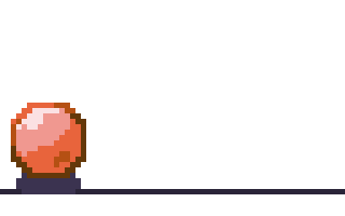
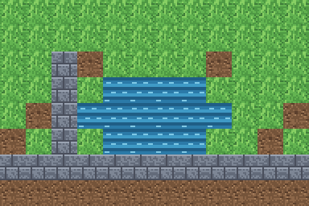

# Aseprite MCP

[](https://github.com/MalloyTheDev/aseprite-mcp/actions/workflows/ci.yml)
[](LICENSE)
[](https://www.python.org/)
[](https://modelcontextprotocol.io)

<p align="center">
  
  &nbsp;
  
  &nbsp;
  
</p>
<p align="center">
  
</p>
<p align="center">
  <sub>Drawn, shaded, animated, timed and then <strong>measured</strong>: entirely through MCP
  tool calls, with no manual pixel-pushing. Every image here is
  <a href="scripts/showcase/README.md">regenerated by a script</a> in this repository.</sub>
</p>

An extensive [Model Context Protocol](https://modelcontextprotocol.io) server that lets an
AI agent (Claude Code, Claude Desktop, or any MCP client) **create and edit
[Aseprite](https://www.aseprite.org/) sprites**: draw pixel art, build animations,
manage layers/frames/tags/palettes, and export to PNG/GIF/sprite sheets, all headlessly.

📖 **Full tool reference:** [`docs/TOOLS.md`](docs/TOOLS.md): every tool with its parameters.

It works by generating **Lua scripts** and running them through Aseprite's batch mode
(`aseprite -b --script ...`), plus the Aseprite CLI for exports. Every operation opens a
real `.aseprite` file, edits it, and saves, so your files stay fully editable in the
Aseprite GUI.

- **147 tools** across every part of a sprite: drawing (pixel-perfect and anti-aliased),
  custom brushes and symmetry, ramp-aware shading, selections that scope later edits,
  palettes, layers, frames, cels, animation tags, slices and 9-patch, effects, text,
  tilemaps, transforms, and export (per-layer, per-tag, sprite sheets, GIF, onion-skin,
  Godot, Minecraft). See the [tool catalogue](#tool-catalogue) or the full
  [reference](docs/TOOLS.md).
- **Whole assets in one call** - **workflow** tools scaffold and validate a character, an
  icon set, a tileset or an eight-direction walk template, and a **batch op-runner**
  applies hundreds of edits atomically in a single Aseprite process.
- **Shading that stays on the palette** - `shade_region_by_light` turns a flat region
  into a lit form from a ramp and a light direction (with an optional second, weaker fill
  light so the shadow side stays readable), `gradient_map` brings imported or
  filtered art onto a ramp in the first place, and `specular_highlight`, `contact_shadow`,
  `cast_shadow`, `glow`, `outline_smart` and
  `dither_band` finish it. A brightness filter moves every pixel off
  the palette; these move pixels *along the ramp*, so the art still uses exactly the
  colours it was given. A glow of blended alpha or a shadow of multiplied alpha would
  break that, which is why both are built of ramp steps arranged in space instead.
- **Work you can check** - `assess_sprite` measures the drawing itself: pixels with no
  neighbour of their own colour, jagged diagonals, how much of the canvas the art fills,
  whether it is centred, and what fraction of it sits exactly on a declared ramp. An agent
  cannot look at its own sprite, so every fault comes back as a line saying what it is and
  which tool puts it right, and `remove_stray_pixels` is the one that answers for noise.
- **Edits you can check** - `diff_sprites` compares two frames and says what changed, in
  buckets that mean different things: pixels that entered or left the *silhouette*, pixels
  repainted inside it, and pixels that changed only their alpha. An edit that silently went
  nowhere, to the wrong layer, inside a stale selection, off the canvas, looks exactly like
  an edit that was not needed, so "nothing changed" is reported loudly rather than quietly.
  Pass `expect=` to turn the measurement into a check.
- **Animation you can check** - `offset_cels` moves a cel along a line or an arc across
  any number of frames in one launch, with the spacing distributed so it reads as speed
  rather than as a limp; `tween_cels` does the other three things an inbetween does,
  scaling, turning and fading one drawn cel across frames, with the anchor on the contact
  edge so a squash lands on the ground; `smear_frame` draws one frame's subject along its
  own movement, stepping down a declared ramp so the trail stays on the palette;
  `apply_timing_curve` gives the cycle a shape in time by setting durations, never by
  duplicating a frame; and `validate_loop` measures the result and names the faults a
  still frame hides: a wrap frame repeating the first, a pose held by duplication,
  placeholder timing, a contact edge that drifts.
- **Sandboxed file access**: by default the file capability is scoped to the workspace
  (relative paths only; absolute/`..` paths rejected unless you opt in).
- **No-clobber by default**: output-writing tools refuse to overwrite an existing file;
  pass `overwrite=True` to replace it intentionally.
- **Structured results**: every tool returns JSON describing the updated sprite.
- **`render_preview`** returns a PNG so the agent can *see* its work and self-correct.
- **Deterministic, stateless, robust**: each call is an isolated, headless Aseprite run.

---

## Contents

| | |
| --- | --- |
| [Showcase](#showcase) | What the tools produce, with the numbers behind it |
| [Requirements](#requirements) · [Install](#install) · [Configuration](#configuration) | Getting it running |
| [Register with an MCP client](#register-with-an-mcp-client) | Claude Code, Claude Desktop, Cursor, Codex, Continue, Zed, Goose ([full guide](docs/CLIENTS.md)) |
| [High-level workflows](#high-level-workflows) · [Batch operations](#batch-operations) | Whole assets in one call; many edits in one process |
| [Tool catalogue](#tool-catalogue) | All 147 tools by domain ([full reference](docs/TOOLS.md)) |
| [Live viewing](#live-viewing-gui-companion-mode) · [Example agent workflow](#example-agent-workflow) | Watching edits land; an end-to-end run |
| [How it works](#how-it-works) · [Security](#security) | Architecture, the sandbox, and what is enforced |
| [Notes & limitations](#notes--limitations) · [Troubleshooting](#troubleshooting) | Honest edges, and what to do when something breaks |

---

## Showcase

Every image here was produced **entirely through MCP tool calls**, and every number under
them is real output from the same run.

### Shade a form, not a filter

<p align="center">
  
</p>
<p align="center">
  <sub>Flat fill, then <code>shade_region_by_light</code>, then <code>dither_band</code> and <code>outline_smart</code>.</sub>
</p>

```python
ramp = generate_ramp("#5a7fd4", steps=5, hue_shift=-40, saturation_shift=-18)["colors"]
draw_ellipse_in_box("orb.aseprite", 4, 4, 24, 24, ramp[2], filled=True)
shade_region_by_light("orb.aseprite", ramp, light_angle=125, light_z=0.55, rim=0.25)
dither_band("orb.aseprite", ramp, from_step=1, to_step=2, pattern="bayer4", width=2)
outline_smart("orb.aseprite", ramp, darken_steps=2, light_angle=125)
```

A brightness filter would have moved every pixel off the palette. These tools move pixels
*along the ramp*, so the result still uses exactly the five colours it was given: the
shading is made of the palette rather than applied on top of it.

### Animate it, then measure the animation

<p align="center">
  
</p>
<p align="center">
  <sub>One <code>offset_cels</code> call for the arc, one for the shadow, one
  <code>apply_timing_curve</code> for the timing, then <code>validate_loop</code> to check it.</sub>
</p>

```python
frames = list(range(1, 13))
offset_cels("throw.aseprite", "ball",   frames, dx=46, arc_height=20)   # the arc
offset_cels("throw.aseprite", "shadow", frames, dx=46)                  # straight along the ground
apply_timing_curve("throw.aseprite", curve="hold_extremes", base_ms=70)
validate_loop("throw.aseprite", layer="ball", loops=False)
```

```text
spacing      8.06  6.4  6.4  5.0  4.03  4.0  4.03  5.0  6.4  6.4  8.06
contact_row    32   25   20   16    13   12    12   13   16   20   25   32
durations     175   70   70   70    70   70   175   70   70   70   70   70
passed: true
```

An agent cannot watch a GIF play. It can read that the spacing is symmetric about the
apex, that the ball slows as it rises and speeds as it falls, and that the extremes are
held two and a half times as long as the passing frames.

### Scaffold a whole asset in one call

<p align="center">
  
</p>
<p align="center">
  
</p>
<p align="center">
  <sub><code>create_rpg_item_sheet</code> lays out a named slice per item and
  <code>make_8_direction_walk_template</code> generates the frames <strong>and one
  animation tag per direction</strong>; both are then drawn into with the drawing and
  shading tools. Each item carries its own ramp, so the potion's glass, liquid and cork
  are shaded independently.</sub>
</p>

```text
validate_sprite_for_game_export -> passed  (width, height, color_mode, min_frames, required_tags)
export_game_asset_bundle        -> hero.png, hero.gif, hero_sheet.png (+JSON), hero_idle.gif, manifest.json
```

<details>
<summary>More examples</summary>

<p align="center">
  
  &nbsp;
  
  &nbsp;
  
  &nbsp;
  
  &nbsp;
  
</p>
<p align="center">
  <sub>The eight-direction template playing through, a bouncing slime, a skeleton, a
  tilemap scene built from four painted tiles, and a hue-shifted <code>generate_ramp</code>
  palette.</sub>
</p>

</details>

---

## Requirements

- **Aseprite 1.3+** (the scripting API). The Steam and standalone builds both work.
- **Python 3.10+**
- **[uv](https://docs.astral.sh/uv/)** (recommended), or any PEP 517 installer.

## Install

```bash
git clone https://github.com/MalloyTheDev/aseprite-mcp.git
cd aseprite-mcp
uv sync
```

That creates a virtual environment and installs the `aseprite-mcp` package and its
dependencies. Verify it can find Aseprite and run the test suite (tests auto-skip if
Aseprite isn't found):

```bash
uv run pytest
```

## Configuration

Everything is configurable via environment variables (all optional):

| Variable | Purpose | Default |
| --- | --- | --- |
| `ASEPRITE_PATH` | Full path to `Aseprite.exe` / `aseprite`. | Auto-detected (Steam, standalone, PATH). |
| `ASEPRITE_MCP_WORKSPACE` | Folder where **relative** sprite paths are resolved. | `<repo>/workspace` |
| `ASEPRITE_MCP_TIMEOUT` | Per-operation timeout in seconds (clamped to 1-3600). | `90` |
| `ASEPRITE_MCP_ALLOW_ABSOLUTE` | Allow absolute / workspace-escaping paths (`1`/`true` to enable). | off (sandboxed) |
| `ASEPRITE_MCP_TRANSPORT` | `stdio`, `streamable-http`, or `sse`. See the warning below before using an HTTP transport. | `stdio` |

`stdio` is the right default: it is what desktop MCP clients launch, and it keeps the
server reachable only by the process that started it. The HTTP transports exist for
agents that cannot spawn a local process. Treat them as a deliberate exposure decision:
this server's file access is scoped by a workspace directory, not by an identity, so
binding it to a reachable port gives every caller that can reach it the same filesystem
access the local user has. Bind to loopback, or put authentication in front of it.

On this machine Aseprite was detected at
`C:\Program Files (x86)\Steam\steamapps\common\Aseprite\Aseprite.exe`, so `ASEPRITE_PATH`
is not strictly required, but setting it explicitly is the most reliable.

---

## Register with an MCP client

**Using something other than Claude?** [`docs/CLIENTS.md`](docs/CLIENTS.md) has a
copy-paste config block per client format (Codex CLI's TOML, Continue's `config.yaml`,
Zed's `context_servers`, Goose's `extensions`, and the `mcpServers` JSON that Claude
Desktop, Cursor, Cline, Roo Code, Windsurf and LM Studio share), the config file path for
each one, the launch form that avoids the Windows venv lock, and the strict-mode notes for
OpenAI or Grok style function-calling bridges. The two quick starts below cover the common
case.

Replace `/ABSOLUTE/PATH/TO/aseprite-mcp` below with the absolute path to your clone.

### Claude Code (CLI)

```bash
claude mcp add aseprite -- uv --directory /ABSOLUTE/PATH/TO/aseprite-mcp run aseprite-mcp
```

To set the Aseprite path explicitly (recommended if auto-detection fails):

```bash
claude mcp add aseprite \
  --env ASEPRITE_PATH="/path/to/Aseprite.exe" \
  -- uv --directory /ABSOLUTE/PATH/TO/aseprite-mcp run aseprite-mcp
```

### Claude Desktop / generic MCP client (JSON)

Add this to your client's MCP server config (e.g. `claude_desktop_config.json`). A
ready-to-copy template lives in [`mcp-config.example.json`](mcp-config.example.json)
(Windows-style paths shown; adjust for your OS):

```json
{
  "mcpServers": {
    "aseprite": {
      "command": "uv",
      "args": ["--directory", "C:\\path\\to\\aseprite-mcp", "run", "aseprite-mcp"],
      "env": {
        "ASEPRITE_PATH": "C:\\Program Files (x86)\\Steam\\steamapps\\common\\Aseprite\\Aseprite.exe",
        "ASEPRITE_MCP_WORKSPACE": "C:\\path\\to\\aseprite-mcp\\workspace"
      }
    }
  }
}
```

Restart the client; the `aseprite` server and its full tool set will be available (the
current count is at the top of [`docs/TOOLS.md`](docs/TOOLS.md)). Ask the agent to run
`health_check` to confirm Aseprite is wired up correctly, and see
[`docs/CLIENTS.md`](docs/CLIENTS.md#4-verify-it-works) for what the answer should look
like.

---

## High-level workflows

Beyond the low-level tools, a few **workflow tools** scaffold a whole asset in one call
and return a manifest (created files, paths, frames, tags, dimensions, and suggested next
steps) so an agent can keep going. They compose the low-level tools:
deterministic scaffolding, no AI generation.

| Tool | Description |
| --- | --- |
| `create_character_sprite` | Transparent canvas + body/details layers + a generated shading ramp + an outlined placeholder. |
| `make_4_frame_idle_animation` | Turn a 1-frame sprite into a 4-frame idle "bob" loop with a tag. |
| `create_tileset_project` | Canvas + tilemap layer + a starter tileset (grass/dirt/water/stone, or your own). |
| `create_icon_set` | Grid sheet of icon cells, each a placeholder inside a named slice (`icon_0`, …). |
| `create_rpg_item_sheet` | Grid sheet with a named slice per item (sword/shield/potion/…). |
| `make_8_direction_walk_template` | 8-direction walk template: frames + one tag per direction (N/NE/E/…). |
| `export_game_asset_bundle` | PNG + animated GIF + sprite sheet (+ JSON) + per-tag GIFs + `manifest.json`. |
| `export_godot_spriteframes` | Godot 4 `SpriteFrames` resource (.tres) + packed sheet; one animation per tag, timed from frame durations. |
| `export_slice_metadata` | Engine-agnostic `<sprite>_slices.json`: hitbox/hurtbox/collision/attach/9-slice/pivot from slice names or JSON data. |
| `validate_sprite_for_game_export` | Check a sprite is game-ready (dimensions/tile multiple, colour mode, frames, required tags, transparency, palette budget, exports exist) → pass/fail report. |
| `validate_asset_spec` / `plan_asset_spec` / `build_asset_from_spec` | Describe an asset once (`aseprite_mcp.asset_spec.v1`), then validate it, dry-run the plan, or build it (structure only, canvas/layers/frames/tags/slices/palette + exports; you draw the art). |

> "Make me an idle-animated hero and a game-ready bundle."

1. `create_character_sprite("hero", 32, 32, base_color="#3878c8")` builds layers, palette and a placeholder.
2. Draw the character on the `body` / `details` layers (low-level tools).
3. `make_4_frame_idle_animation("hero.aseprite")` makes a 4-frame loop tagged `idle`.
4. `validate_sprite_for_game_export("hero.aseprite", expected_width=32, required_tags=["idle"])` confirms it is game-ready.
5. `export_game_asset_bundle("hero.aseprite", scale=8)` writes PNG/GIF/sheet+JSON/manifest into `hero_bundle/`.

### Workflow manifest contract

Every workflow tool returns a standardized **`workflow_manifest.v1`** object (defined in
[`core/manifest.py`](src/aseprite_mcp/core/manifest.py)) so the asset layer stays
consistent as it grows. Always present: `ok`, `schema_version`, `kind`, `created_files[]`,
`suggested_next_actions[]`, `warnings[]`. Included when relevant: `sprite{}`, `exports[]`,
`palette{}`, `animation{}`, `tilemap{}`. File/export entries are
`{role, path, format, metadata_path?}`.

```json
{
  "ok": true,
  "schema_version": "workflow_manifest.v1",
  "kind": "character_sprite",
  "sprite": { "path": "...", "width": 32, "height": 32, "color_mode": "rgb",
              "frames": 1, "layers": ["body", "details"], "tags": [] },
  "created_files": [ { "role": "source_sprite", "path": "...", "format": "aseprite" } ],
  "palette": { "colors": ["#1b1f2a", "..."], "count": 5 },
  "suggested_next_actions": ["Draw the character on the 'body' layer", "..."],
  "warnings": []
}
```

---

## Batch operations

`apply_operations` applies a list of edits to one sprite in a **single Aseprite process**,
**atomically**: open once → run every op inside one transaction → save only if all
succeed. This collapses multi-launch agent flows (add layer → draw → add frame → tag)
into one fast, all-or-nothing call. Pass `dry_run=true` to validate the op list **without
launching Aseprite**.

```jsonc
apply_operations("hero.aseprite", [
  {"op": "add_layer",      "args": {"name": "fg"}},
  {"op": "fill_layer",     "args": {"layer": "fg", "color": "#1d2b53"}},
  {"op": "draw_rectangle", "args": {"layer": "fg", "x": 2, "y": 2, "width": 12, "height": 8, "color": "#ff004d"}},
  {"op": "add_frame",      "args": {"copy_from": 1, "duration_ms": 120}},
  {"op": "add_tag",        "args": {"name": "idle", "from": 1, "to": 2}}
])
```

If any op fails, the whole batch rolls back and the error names the failing op index.
v1 ops: layer add/rename/visible/opacity/remove · frame add/duplicate/duration ·
tag add/remove · draw set_pixel/line/rectangle/fill_rectangle/ellipse/fill_ellipse/fill_layer/clear_layer ·
slice add/remove · replace_color.

---

## Tool catalogue

Relative filenames resolve inside the workspace (absolute paths require
`ASEPRITE_MCP_ALLOW_ABSOLUTE=1`; see [Security](#security)).
Frames and palette-aware operations are **1-based** for frames, **0-based** for palette
indices. Colours accept `#RRGGBB`, `#RRGGBBAA`, `r,g,b`, `r,g,b,a`, `index:N`, or a name
(`black`, `white`, `red`, `green`, `blue`, `yellow`, `cyan`, `magenta`, `transparent`, …).

### Sprite lifecycle
| Tool | Description |
| --- | --- |
| `create_sprite` | Create & save a new sprite (`rgb`/`indexed`/`gray`, optional background; `indexed` starts with a usable palette). |
| `save_sprite_as` | Save a copy under a new path (optionally flattened). |
| `set_color_mode` | Convert between `rgb` / `indexed` / `gray` (with dithering); builds the palette from the art and refuses to drop pixels. |
| `resize_canvas` | Change canvas size without scaling art (`top_left` / `center`). |
| `crop_sprite` | Crop the canvas to a rectangle. |
| `scale_sprite` | Scale the whole sprite (by factor or to dimensions; `nearest`/`bilinear`). |
| `flatten_sprite` | Flatten all layers into one. |
| `trim_sprite` | Auto-crop the canvas to non-transparent content. |
| `convert_layer_to_background` · `convert_background_to_layer` | Toggle the opaque Background layer. |

### Inspection & preview
| Tool | Description |
| --- | --- |
| `get_sprite_info` | Full structured state: size, mode, frames, layer tree, tags, palette. |
| `render_preview` | Render a frame to a PNG image you can view (scaled). |
| `get_pixels` | Read composited pixel colours of a region (≤ 64×64 per call). |
| `assess_sprite` | Measure the drawing: colours and ramps, noise, jagged diagonals, how much of the canvas is used, centring, symmetry, palette conformance against a declared ramp, and tile seams. Each measurement worth acting on comes back with a line saying why. |
| `diff_sprites` | Compare two frames pixel for pixel: pixels added to or removed from the silhouette, repainted inside it, or changed in alpha alone, plus the colours involved and the box they sit in. Says so loudly when nothing changed, and takes `expect=` to turn the measurement into a pass or a fail. |
| `list_sprites` | List sprite/image files in the workspace. |

### Layers
| Tool | Description |
| --- | --- |
| `add_layer` | Add a layer (optional group, opacity, blend mode, visibility). |
| `add_group_layer` | Add a group layer. |
| `remove_layer` · `rename_layer` | Delete / rename a layer. |
| `set_layer_properties` | Update opacity, blend mode, visibility, editability, name. |
| `move_layer` | Reorder a layer (1-based stack index, 1 = bottom). |
| `duplicate_layer` · `merge_layer_down` | Duplicate / merge a layer down. |

### Frames (animation)
| Tool | Description |
| --- | --- |
| `add_frame` | Append a frame (empty, or a copy of another). |
| `duplicate_frame` · `remove_frame` | Duplicate / delete a frame. |
| `set_frame_duration` · `set_all_frame_durations` | Set per-frame / uniform durations (ms). |
| `reverse_frames` · `move_frame` | Turn a run of frames round, or move one frame to another position. Cels on every layer, durations and cel links all travel with the frame. |

### Cels (a layer's image at a frame)
| Tool | Description |
| --- | --- |
| `get_cel` | Inspect a cel (exists, position, bounds, opacity). |
| `set_cel_position` · `set_cel_opacity` | Move / fade a cel. |
| `copy_cel` · `delete_cel` | Copy a cel between frames / delete it. |
| `link_cels` · `unlink_cels` | Share one image across frames (a held pose: editing any of them edits all, and the file stores it once) / give a frame its own copy back. |

### Animation tags
| Tool | Description |
| --- | --- |
| `add_tag` | Tag a frame range with a name, direction, colour, and a repeat count (0 means forever, which is how a cycle is marked). |
| `set_tag` · `remove_tag` | Edit / delete a tag. |

### Animation (motion, timing, checks)
| Tool | Description |
| --- | --- |
| `offset_cels` | Move a drawn cel along a line or an arc across frames in one launch, spacing distributed so it reads as speed rather than as a limp. |
| `tween_cels` | Scale, turn and fade one drawn cel across frames in one launch: squash and stretch (the two axes go opposite ways), whole-degree rotation sampled nearest-neighbour so no colour is invented, and a fade that sets cel opacity rather than baking alpha. `anchor="bottom"` squashes onto the ground, which `validate_loop`'s contact check then confirms. |
| `smear_frame` | Draw one frame's subject along its own movement, so fast motion reads as speed rather than as teleportation. `stretch` elongates it and thins to a point; `echo` draws it several times. The vector comes from the cels themselves, and with a `ramp` every trail pixel is a colour the sprite already had. |
| `apply_timing_curve` | Give a cycle a shape in time (`hold_extremes`, `attack`, `ease_in`, `ease_out`, `flat`), or hold and snap named poses. Sets durations and never duplicates a frame. |
| `validate_loop` | Measure a cycle instead of playing it: per-frame hashes, spacing, contact rows, durations, and the faults a still frame hides (a wrap frame repeating the first, duplicated poses, placeholder timing, a drifting contact edge). |

Easing belongs in one of these at a time. Eased spacing plus an eased duration curve is the
same curve applied twice, and reads as slow motion; `apply_timing_curve` measures the cels
and says so rather than doing it quietly.

### Drawing
| Tool | Description |
| --- | --- |
| `draw_pixels` | Plot individual pixels (per-pixel or shared colour). |
| `draw_line` · `draw_polyline` | Line / connected segments; `pixel_perfect` & `antialias` options. |
| `draw_curve` | Quadratic Bézier curve. |
| `draw_rectangle` · `draw_ellipse` | Outline or filled rectangle / ellipse; ellipse has `antialias`. |
| `draw_ellipse_in_box` | An ellipse filling the same bounding box `draw_rectangle` takes, so an even diameter is possible and a circle can line up with a rectangle. |
| `fill_area` | Flood fill (paint bucket) from a point. |
| `fill_layer` · `clear_layer` | Fill the whole cel / erase it to transparent. |

### Brushes & symmetry
| Tool | Description |
| --- | --- |
| `draw_brush` | Stamp a custom brush shape (ASCII mask) at many points. |
| `stamp_pattern` | Tile an image/sprite across a region (with spacing, opacity, blend). |
| `mirror_layer` | Reflect one half of a layer onto the other (build symmetric art). |
| `draw_symmetric_pixels` | Plot pixels with horizontal/vertical/4-way mirroring. |

### Shading & light
| Tool | Description |
| --- | --- |
| `shade_region_by_light` | Shade a flat region as a lit form, from a ramp and a light direction. |
| `gradient_map` | Put every pixel on a ramp by its brightness, whatever it started as: the tool that brings imported or filtered art onto a palette at all. Optional ordered dithering. |
| `shift_along_ramp` | Move pixels along a colour ramp, keeping every one of them on the palette. |
| `specular_highlight` | Place a small glint where the light reflects at the viewer, never on an edge pixel. The ramp's top step, or a brighter colour for metal. |
| `contact_shadow` | Darken the pixels where one form meets another, along its ramp. |
| `outline_smart` | Outline a shape in colours taken from its own ramp, not one flat colour. |
| `dither_band` | Dither the boundary between two adjacent ramp steps, widening the transition. |

### Selections
| Tool | Description |
| --- | --- |
| `select_region` | Select a rectangle, ellipse, or polygon (`replace`/`add`/`subtract`/`intersect`). |
| `select_by_color` | Magic wand: select every pixel matching a colour. |
| `modify_selection` | Grow, shrink, or outline the current selection. |
| `invert_selection` · `deselect` | Swap selected for unselected / clear it. |
| `get_selection` | Report whether there is a selection and what it covers. |

A selection is not stored in the `.aseprite` file, and every call here is its own Aseprite
process, so it is kept in a `.msk` sidecar beside the sprite and loaded again on the next
call. It scopes every later edit until `deselect`, which is how an image editor behaves,
and every result that touched pixels reports `selection_applied`.

### Slices (named regions / 9-patch)
| Tool | Description |
| --- | --- |
| `add_slice` · `set_slice` · `remove_slice` · `list_slices` | Manage slices with optional 9-patch center, pivot, colour, and data. |

### Effects & colour adjustments
| Tool | Description |
| --- | --- |
| `fill_gradient` | Linear/radial gradient, multi-stop, optional Bayer dithering. |
| `fill_checkerboard` | Two-colour checkerboard pattern. |
| `add_outline` | Pixel outline around art (outside/inside, 4/8-connectivity, thickness). |
| `add_drop_shadow` | Hard drop shadow on a new layer beneath the art. |
| `cast_shadow` | A shadow on the ground, away from the light and foreshortened by its height, built of ramp steps and clipped to the surface it falls on. |
| `glow` | A halo of several rings, each a step further down a ramp, optionally dithered at the outer edge. Its own layer, so deleting it removes the effect. |
| `replace_color` | Swap a colour (with per-channel tolerance). |
| `remove_stray_pixels` | Replace pixels with no neighbour of their own colour by the colour around them: the dirt a shading pass leaves, without touching a dither or introducing a colour. |
| `invert_colors` | Invert RGB (alpha preserved). |
| `adjust_brightness_contrast` · `adjust_hue_saturation` · `desaturate` | Colour grading. |

### Text
| Tool | Description |
| --- | --- |
| `draw_text` | Render text (built-in bitmap font or a TrueType file) as crisp pixels. |

### Tilemaps (Aseprite 1.3+)
| Tool | Description |
| --- | --- |
| `create_tilemap_layer` | Create a tilemap layer with a tile size + empty grid. |
| `add_tile` · `fill_tile` · `paint_tile_pixels` | Define/draw the tileset artwork. |
| `set_tile` · `set_tiles` · `fill_tilemap` | Place tiles on the grid. |
| `get_tilemap` | Read the grid of tile indices. |

### Image stamping
| Tool | Description |
| --- | --- |
| `stamp_file` | Composite another image/sprite file onto a layer (opacity, blend mode). |
| `draw_image_base64` | Composite an inline base64 image onto a layer. |

### Palette
| Tool | Description |
| --- | --- |
| `get_palette` · `set_palette` | Read / replace the whole palette. |
| `set_palette_color` · `add_palette_color` · `resize_palette` | Edit individual entries / size. |
| `load_palette` | Load a palette from `.gpl`/`.pal`/`.png`/`.aseprite`. |
| `set_transparent_color` | Set the transparent index (indexed sprites). |
| `extract_palette` | Collect the unique colours used in a sprite/image. |
| `sort_palette` | Sort by hue/luminance/saturation/value (remaps indexed pixels). |
| `generate_ramp` | Build a hue-shifted shading ramp from a base colour. |
| `ramp_between` | Build a ramp from its two ends, the cool shadow and the warm highlight, interpolated in Oklab so the middle is a blend rather than a hue rotation. |
| `ramp_from_art` | Recover the ramp a sprite is already painted with, ordered dark to light, with the share of the art each step covers. |

### Transform & export
| Tool | Description |
| --- | --- |
| `flip_sprite` · `rotate_sprite` | Flip (h/v) / rotate (90/180/270) the whole sprite. |
| `export_png` | Export one frame as a flattened PNG (scaled). |
| `export_gif` | Export the animation as an animated GIF. |
| `export_tag_gif` | Export only a named tag's frames as a GIF. |
| `export_spritesheet` | Pack frames into a sheet (+ JSON metadata; layer/tag filters & splits). |
| `export_frames` | Export each frame to its own file (`{frame}` pattern). |
| `export_layer` · `export_layers` | Export one layer / each layer to separate files. |
| `export_tags` | Export each animation tag's frames to separate files. |
| `export_onion_skin` | Render a frame with neighbouring frames ghosted behind it. |
| `import_image` | Build an editable `.aseprite` from a flat image. |

### Minecraft resource packs
| Tool | Description |
| --- | --- |
| `export_minecraft_texture` | Export a sprite into a resource pack at its correct texture path. |
| `validate_minecraft_texture` | Check a sprite against Minecraft's texture rules before it ships. |
| `write_pack_mcmeta` | Write `pack.mcmeta`, the file that makes a directory a resource pack. |
| `write_texture_mcmeta` | Write the `<texture>.png.mcmeta` sidecar for an animated texture. |

### Reference / rotoscope
| Tool | Description |
| --- | --- |
| `add_reference_layer` | Add a dimmed, locked layer holding a reference image to trace over. |
| `import_reference_sequence` | Import a sequence of images as per-frame references (rotoscoping). |

### Batch operations
| Tool | Description |
| --- | --- |
| `apply_operations` | Apply many edits to one sprite atomically in a single process (`dry_run` to validate only). See [Batch operations](#batch-operations). |

### GUI companion mode
| Tool | Description |
| --- | --- |
| `open_in_editor` | Open a sprite in the live Aseprite GUI window (non-blocking) to watch edits. |
| `gui_available` | Report whether the Aseprite GUI can be launched. |

### Health & self-test
| Tool | Description |
| --- | --- |
| `health_check` | Self-test: Aseprite found?, version, workspace, tool count, and a real create+export round-trip. |

---

## Live viewing (GUI companion mode)

The server edits files **headlessly**, but you can watch the work in the real Aseprite
window. Call `open_in_editor("sprite.aseprite")` and Aseprite opens it in a normal,
non-blocking window. As the agent keeps saving edits with the other tools, Aseprite
detects the on-disk change and offers to reload (or reloads automatically, depending on
your Aseprite preferences), so edits appear without re-opening.

**What this is and isn't:** Aseprite's Lua scripting sandbox has no networking or timers,
so the server can't *stream* a live canvas into the GUI frame-by-frame. The companion view
above (open once → headless edits → Aseprite reloads) is the robust, supported workflow.
The agent's own "eyes" remain `render_preview`, which returns a PNG it can inspect directly.

---

## Example agent workflow

> "Make me a 32×32 walking-slime animation."

1. `create_sprite("slime.aseprite", 32, 32, "rgb")`
2. `fill_layer` the background, `add_layer("slime")`, draw the body with
   `draw_ellipse`/`fill_area`/`draw_pixels`.
3. `add_frame(copy_from=1)` a couple of times; nudge the body with `set_cel_position`
   to create a bounce.
4. `set_all_frame_durations(120)` and `add_tag("walk", 1, 3, "pingpong")`.
5. `render_preview` to check it, iterate, then `export_gif("slime.gif", scale=8)`.

---

## How it works

```
client (any MCP client) ──MCP──> aseprite-mcp (MCPServer, Python)
                              │  builds a Lua body + ARG table
                              ▼
                         luagen.assemble_script  ──>  temp .lua
                              │   (prelude: JSON encoder, colour/pixel
                              │    helpers, drawing primitives, info)
                              ▼
                  Aseprite.exe -b --script temp.lua
                              │  prints  @@ASEMCP@@<json>  (or @@ASEMCP_ERR@@)
                              ▼
                         runner parses the sentinel  ──>  dict back to the client
```

Drawing primitives (line, rectangle, ellipse, flood fill) are implemented deterministically
in Lua and operate on a full-canvas copy of the target cel, so coordinates are always in
sprite space and results are identical across runs. Exports use the Aseprite CLI's native
flags (`--sheet`, `--scale`, `--data`, …).

### Project layout

```
src/aseprite_mcp/
  app.py          MCPServer instance, tool classification, portable schemas
  server.py       imports every tool module, picks the transport, main()
  core/           config (locate Aseprite, workspace, path sandbox), limits,
                  errors, models, luagen (Python->Lua + the shared PRELUDE),
                  runner (run_lua / run_cli, sentinel parsing), oplib (the batch
                  op registry), manifest, validation, asset_spec, minecraft,
                  quality, loopcheck and motion (animation maths)
  tools/          one module per domain: sprite, inspect, layers, frames, tags,
                  cels, animation, drawing, brushes, shading, selection, effects,
                  text, tilemap, image, palette, slices, transform, export,
                  export_presets, minecraft, reference, workflow, asset_spec,
                  batch, gui, health (+ common.py)
docs/TOOLS.md     full auto-generated tool reference, every registered tool
docs/CLIENTS.md   per-client setup, transports, and what to do when a client
                  mangles arguments
scripts/          gen_tool_docs.py (regenerates docs/TOOLS.md), quality_report.py
tests/            pytest suite: the pure tests always run, the rest need
                  --run-aseprite
```

## Security

This server hands an AI agent a **file capability**, so access is scoped by default:

- **Workspace-sandboxed paths.** Relative filenames resolve under
  `ASEPRITE_MCP_WORKSPACE` (default `<repo>/workspace`). Absolute paths and paths that
  escape the workspace via `..` (or a symlink that points outside it) are **rejected**
  unless you set `ASEPRITE_MCP_ALLOW_ABSOLUTE=1`.
- **No-clobber by default.** Every output-writing tool (`create_sprite`, `save_sprite_as`,
  `import_image`, all `export_*`, `export_game_asset_bundle`) refuses to overwrite an
  existing file; pass `overwrite=True` to replace it on purpose. Multi-file exports
  validate every target up front, so they fail before writing anything if any target
  already exists. Pattern exports (`frames/walk_{frame}.png`) are expanded by Aseprite
  itself, so they are checked against everything the pattern could match.
- **Bounded work per call.** A single call cannot exhaust the host: batch op-lists and
  pixel/tile/colour lists are capped, canvases are capped at 16384px per axis **and**
  16,777,216 pixels of area (so two individually-legal axes can't add up to gigabytes),
  inline base64 images at 32 MB, and text rasterization is budgeted while it renders.
  `ASEPRITE_MCP_TIMEOUT` is clamped to 1-3600s so it can't be set to something that
  disables the timeout.
- **No shell, no injection.** Aseprite is invoked with list-form arguments (never a
  shell), and every user value is passed into generated Lua through an escaped `ARG`
  table: user input is never concatenated into Lua source.
- **Bring your own Aseprite.** The server only runs the Aseprite binary you point it at.

Run `health_check` to confirm the configuration (Aseprite path, workspace, sandbox state).

## Notes & limitations

- **Each call is its own process.** A tool call is an independent headless Aseprite run,
  so in-memory state (undo history, the "active" sprite) does **not** carry over, and
  operations take explicit coordinates rather than relying on what was open. The one piece
  of editor state that does survive is the selection: the selection tools keep it in a
  `.msk` sidecar beside the sprite and reload it on the next call, so it scopes later edits
  and `deselect` is a real step rather than a formality. A future **live-GUI mode** can
  layer on top of this without changing the tool API.
- Use a `.aseprite`/`.ase` extension to keep layers, frames, and tags editable. Saving to
  `.png`/`.gif` flattens.
- `get_pixels` is capped at 4096 px (e.g. 64×64) per call; read in tiles for larger areas.
- Anti-aliasing (`antialias=True`) only applies to RGB sprites; it's ignored on
  indexed/gray. Tilemaps and reference layers require **Aseprite 1.3+**.

## Troubleshooting

- **"Could not locate Aseprite."** Set `ASEPRITE_PATH` to the full executable path.
- **Nothing happens / permission denied on save.** Ensure the workspace path is writable.
  Relative filenames go under `ASEPRITE_MCP_WORKSPACE` (default `<repo>/workspace`).
- **Timeouts** on big operations: raise `ASEPRITE_MCP_TIMEOUT` (seconds).
- **A tool errors with a Lua message.** The message is surfaced verbatim from Aseprite,
  it usually names the bad argument (e.g. a missing layer/frame).
- **Tests all skip.** That's expected when Aseprite isn't installed/found; set
  `ASEPRITE_PATH` to run them for real.

Client-side problems (sprites landing in a venv directory, a text-only model that cannot
see `render_preview`, the Windows lock on `.venv\Scripts\aseprite-mcp.exe` that blocks
`uv sync`, a server that never appears) are covered in
[`docs/CLIENTS.md`](docs/CLIENTS.md#5-troubleshooting).

## Development

```bash
uv run pytest                              # integration tests (need Aseprite)
uv run aseprite-mcp                        # run the server over stdio (manual debugging)
uv run python scripts/gen_tool_docs.py     # regenerate docs/TOOLS.md
```

See [CONTRIBUTING.md](CONTRIBUTING.md) for the architecture and how to add a tool, and
[CHANGELOG.md](CHANGELOG.md) for release notes.

## Contributing

Contributions are welcome! Please read [CONTRIBUTING.md](CONTRIBUTING.md), add a test for
your change, and regenerate the tool reference before opening a PR.

## License

[MIT](LICENSE) © Brendan Malloy.

## Disclaimer

This is an independent, unofficial project and is **not affiliated with or endorsed by**
Aseprite or Igara Studio S.A. "Aseprite" is a trademark of its respective owner. You need
your own licensed copy of Aseprite for this server to function.
