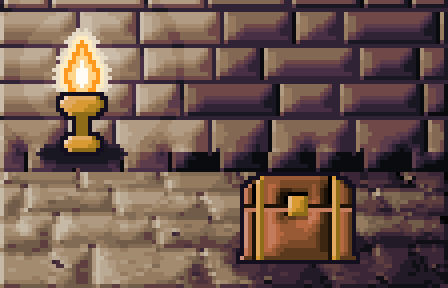
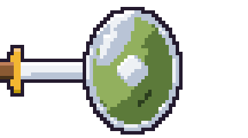
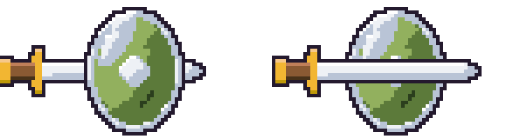
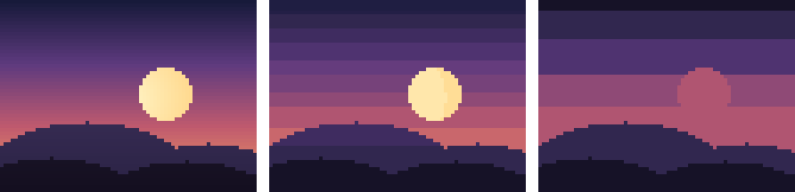
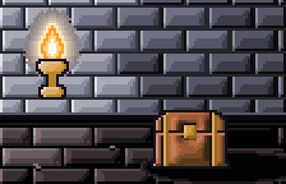

# Aseprite MCP

[](https://github.com/MalloyTheDev/aseprite-mcp/actions/workflows/ci.yml)
[](LICENSE)
[](https://www.python.org/)
[](https://modelcontextprotocol.io)

<p align="center">
  
</p>
<p align="center">
  
  &nbsp;
  
  &nbsp;
  
  &nbsp;
  
</p>
<p align="center">
  <sub>Drawn, shaded, animated, timed and then <strong>measured</strong>: entirely through MCP
  tool calls, with no manual pixel-pushing. Every image here is
  <a href="scripts/showcase/README.md">regenerated by a script</a> in this repository.</sub>
</p>

An extensive [Model Context Protocol](https://modelcontextprotocol.io) server that lets an
AI agent (Claude Code, Claude Desktop, or any MCP client) **create and edit
[Aseprite](https://www.aseprite.org/) sprites**: draw pixel art, build animations,
manage layers/frames/tags/palettes, and export to PNG/GIF/sprite sheets, all headlessly.

📖 **Full tool reference:** [`docs/TOOLS.md`](docs/TOOLS.md): every tool with its parameters.

It works by generating **Lua scripts** and running them through Aseprite's batch mode
(`aseprite -b --script ...`), plus the Aseprite CLI for exports. Every operation opens a
real `.aseprite` file, edits it, and saves, so your files stay fully editable in the
Aseprite GUI.

- **155 tools** across every part of a sprite: drawing (pixel-perfect and anti-aliased),
  custom brushes and symmetry, ramp-aware shading, selections that scope later edits,
  palettes, layers, frames, cels, animation tags, slices and 9-patch, effects, text,
  tilemaps, transforms, and export (per-layer, per-tag, sprite sheets, GIF, onion-skin,
  Godot, Minecraft). See the [tool catalogue](#tool-catalogue) or the full
  [reference](docs/TOOLS.md).
- **Whole assets in one call** - **workflow** tools scaffold and validate a character, an
  icon set, a tileset or an eight-direction walk template, and a **batch op-runner**
  applies hundreds of edits atomically in a single Aseprite process.
- **Shading that stays on the palette** - `shade_region_by_light` turns a flat region
  into a lit form from a ramp and a light direction (with an optional second, weaker fill
  light so the shadow side stays readable), `gradient_map` brings imported or
  filtered art onto a ramp in the first place, and `specular_highlight`, `contact_shadow`,
  `cast_shadow`, `glow`, `outline_smart` and
  `dither_band` finish it. A brightness filter moves every pixel off
  the palette; these move pixels *along the ramp*, so the art still uses exactly the
  colours it was given. A glow of blended alpha or a shadow of multiplied alpha would
  break that, which is why both are built of ramp steps arranged in space instead.
- **Indexed mode that draws** - `create_sprite` gives an indexed sprite a real 33-entry
  palette (a transparent entry at index 0, then Aseprite's 32 defaults) rather than the
  256 identical blacks that made every colour equidistant, so every draw resolved to
  index 0 and vanished while reporting success. `set_color_mode` quantizes the palette
  from the art instead of mapping onto whatever the file happened to carry, and refuses a
  conversion that would make drawn pixels disappear.
- **Work you can check** - `assess_sprite` measures the drawing itself: pixels with no
  neighbour of their own colour, jagged diagonals, how much of the canvas the art fills,
  whether it is centred, and what fraction of it sits exactly on a declared ramp. An agent
  cannot look at its own sprite, so every fault comes back as a line saying what it is and
  which tool puts it right, and `remove_stray_pixels` is the one that answers for noise.
- **Edits you can check** - `diff_sprites` compares two frames and says what changed, in
  buckets that mean different things: pixels that entered or left the *silhouette*, pixels
  repainted inside it, and pixels that changed only their alpha. An edit that silently went
  nowhere, to the wrong layer, inside a stale selection, off the canvas, looks exactly like
  an edit that was not needed, so "nothing changed" is reported loudly rather than quietly.
  Pass `expect=` to turn the measurement into a check.
- **Animation you can check** - `offset_cels` moves a cel along a line or an arc across
  any number of frames in one launch, with the spacing distributed so it reads as speed
  rather than as a limp; `tween_cels` does the other three things an inbetween does,
  scaling, turning and fading one drawn cel across frames, with the anchor on the contact
  edge so a squash lands on the ground; `smear_frame` draws one frame's subject along its
  own movement, stepping down a declared ramp so the trail stays on the palette;
  `apply_timing_curve` gives the cycle a shape in time by setting durations, never by
  duplicating a frame; and `validate_loop` measures the result and names the faults a
  still frame hides: a wrap frame repeating the first, a pose held by duplication,
  placeholder timing, a contact edge that drifts.
- **Calls you can check** - the three bullets above measure the artwork; this one measures
  the call. A tool that did something other than what it was asked for is the failure this
  server keeps finding, and it is always quiet, so the result says *what* happened rather
  than that it happened. A write whose selection excluded every pixel reports
  `pixels_outside_selection` rather than a bare `ok`. `shade_region_by_light` and
  `specular_highlight` report `region_components` and `region_bounds`, because `base_color`
  scopes by colour *distance* and two materials' ramps are routinely closer than the
  default tolerance: every step of a gold ramp is within it of a step of a brass one, so a
  pass can land somewhere its caller never looked. `generate_ramp` reports `distinct` and,
  when lightness clamping has collapsed two steps onto one colour, the `light_range` that
  would not have. `dither_band` names the two colours its 1-based steps resolved to.
  Every one of those exists because its absence cost a debugging session, and the
  [showcase generators](scripts/showcase/README.md) are where they were spent.
- **Sandboxed file access**: by default the file capability is scoped to the workspace
  (relative paths only; absolute/`..` paths rejected unless you opt in).
- **No-clobber by default**: output-writing tools refuse to overwrite an existing file;
  pass `overwrite=True` to replace it intentionally.
- **Structured results**: every editing tool returns JSON describing the updated sprite,
  and every pixel-writing one returns how many pixels it wrote, clipped, skipped, or lost
  to an active selection.
- **`render_preview`** returns a PNG so the agent can *see* its work and self-correct.
- **Deterministic, stateless, robust**: each call is an isolated, headless Aseprite run.

---

## Contents

| | |
| --- | --- |
| [Showcase](#showcase) | What the tools produce, with the numbers behind it: a lit scene, an equipment sheet, per-cel ordering, palette reduction |
| [Requirements](#requirements) · [Install](#install) · [Configuration](#configuration) | Getting it running |
| [Register with an MCP client](#register-with-an-mcp-client) | Claude Code, Claude Desktop, Cursor, Codex, Continue, Zed, Goose ([full guide](docs/CLIENTS.md)) |
| [High-level workflows](#high-level-workflows) · [Batch operations](#batch-operations) | Whole assets in one call; many edits in one process |
| [Tool catalogue](#tool-catalogue) | All 155 tools by domain ([full reference](docs/TOOLS.md)) |
| [Live viewing](#live-viewing-gui-companion-mode) · [Example agent workflow](#example-agent-workflow) | Watching edits land; an end-to-end run |
| [How it works](#how-it-works) · [Security](#security) | Architecture, the sandbox, and what is enforced |
| [Notes & limitations](#notes--limitations) · [Troubleshooting](#troubleshooting) | Honest edges, and what to do when something breaks |

---

## Showcase

Every image here was produced **entirely through MCP tool calls**, and every number under
them is real output from the same run.

### Shade a form, not a filter

<p align="center">
  
</p>
<p align="center">
  <sub>Flat fill, then <code>shade_region_by_light</code>, then <code>dither_band</code> and <code>outline_smart</code>.</sub>
</p>

```python
create_sprite("orb.aseprite", 32, 32)
ramp = generate_ramp("#5a7fd4", steps=5, hue_shift=-40, saturation_shift=-18)["colors"]
draw_ellipse_in_box("orb.aseprite", 4, 4, 24, 24, ramp[2], filled=True)
shade_region_by_light("orb.aseprite", ramp, light_angle=125, light_z=0.55, rim=0.25)
dither_band("orb.aseprite", ramp, from_step=1, to_step=2, pattern="bayer4", width=2)
outline_smart("orb.aseprite", ramp, darken_steps=2, light_angle=125)
```

A brightness filter would have moved every pixel off the palette. These tools move pixels
*along the ramp*, so the result still uses exactly the five colours it was given: the
shading is made of the palette rather than applied on top of it.

### Animate it, then measure the animation

<p align="center">
  
</p>
<p align="center">
  <sub>One <code>offset_cels</code> call for the arc, one for the shadow, one
  <code>apply_timing_curve</code> for the timing, then <code>validate_loop</code> to check it.</sub>
</p>

```python
frames = list(range(1, 13))
offset_cels("throw.aseprite", "ball",   frames, dx=46, arc_height=20)   # the arc
offset_cels("throw.aseprite", "shadow", frames, dx=46)                  # straight along the ground
apply_timing_curve("throw.aseprite", curve="hold_extremes", base_ms=70)
validate_loop("throw.aseprite", layer="ball", loops=False)
```

```text
spacing      8.06  6.4  6.4  5.0  4.03  4.0  4.03  5.0  6.4  6.4  8.06
contact_row    32   25   20   16    13   12    12   13   16   20   25   32
durations     175   70   70   70    70   70   175   70   70   70   70   70
passed: true
```

An agent cannot watch a GIF play. It can read that the spacing is symmetric about the
apex, that the ball slows as it rises and speeds as it falls, and that the extremes are
held two and a half times as long as the passing frames.

### Reorder one cel, not the layer stack

<p align="center">
  
</p>
<p align="center">
  <sub>The same two layers in the same order, on two frames. Only the cel's z-index differs.</sub>
</p>

```python
set_cel_z_index("swing.aseprite", "sword", frame=2, z=0)   # blade behind the shield
set_cel_z_index("swing.aseprite", "sword", frame=3, z=2)   # blade in front, same layer
```

A blade that crosses a shield is behind it on the approach and in front of it on the
follow-through, and a layer stack cannot say that: a layer's position applies to every
frame at once. Moving the layer changes the other frames; duplicating the sword onto a
second layer means hiding one of the two per frame and keeping two drawings in step
forever.

`z` is an offset on the layer's own stack position, so `0` means "wherever this layer
sits" and a cel one layer down needs only `z=1` to draw in front of the one above it. The
result reports the frame's competing cels back to front, because a number alone does not
tell you the arm moved:

```
frame 2  z=0  renders: sword then shield   pixel (45,20) is #5c7a3a, the shield's oak
frame 3  z=2  renders: shield then sword   pixel (45,20) is #eef1f5, the blade's steel
```

That pixel is the whole claim, and [the generator asserts
it](scripts/showcase/zorder.py): a z-index that round-tripped through the file while
changing nothing about the render would produce an identical-looking strip. The blade is
drawn long enough to show its tip on the far side, because "behind" only reads as
occlusion when you can see both ends of the thing being occluded. Note also that
`z` is refused outside -32768 to 32767, because the editor accepts a larger number in
memory and then stores it in a 16-bit field, so saving and reopening turned 32768 into
-32768.

### Turn a blend into pixel art

<p align="center">
  
</p>
<p align="center">
  <sub>117 colours, then 13, then 5. The banding is the palette doing its work, not a filter over the top.</sub>
</p>

```python
quantize_palette("dusk.aseprite", max_colors=14)            # derive a palette from the art
set_color_mode("dusk.aseprite", "indexed", palette_source="keep")   # then map the art onto it
```

`extract_palette` reports the colours an image already uses and `set_color_mode` maps art
onto a palette that exists; `quantize_palette` is the step in between, deriving a small
palette *from* the artwork.

It is two calls on purpose, and the first one touches no pixels. Quantizing derives the
palette and says so:

```
max_colors=14   palette holds 14, art has 117, 8 of them exactly
    warning: 109 of the 117 colours in the art are not in the derived palette and will be
             approximated by their nearest entry when the sprite is converted to indexed.
converted to indexed   3888 drawn pixels, verified=True, now 13 colours
```

`verified=True` is the conversion confirming it did not lose a single drawn pixel, which
is the one thing a mode change must never do quietly. `max_colors` is also a ceiling with
a cliff in it: a budget equal to the number of colours in the art is where the reduction
collapses, and four colours at `max_colors=4` come back as one averaged grey while
`max_colors=5` returns all four. The result says which happened rather than reporting a
clean reduction either way.

### Light a room, not a sprite

<p align="center">
  
</p>
<p align="center">
  <sub>112 by 72 pixels, five ramps, four frames. Every pixel is a ramp entry: nothing here
  is alpha, a blur, or a blend.</sub>
</p>

Three things in that picture are worth more than the picture.

**Thirty-five blocks, one shading call.** `shade_region_by_light` builds a distance field
over everything matching one base colour, and a field over a mask with thirty-five
disconnected parts describes each part on its own. The mortar joints are what make the mask
thirty-five components instead of one slab, so the whole wall takes its form from a single
call:

```python
shade_region_by_light("dungeon.aseprite", STONE, base_color=STONE[8],
                      light_angle=155, bulge=0.75, tolerance=1.0, layer="wall")
```

An earlier version of this section claimed that and left out what it cost. The claim is only
worth anything if the blocks come out *different*, and with every block 17 pixels wide they
did not: a distance field over two components of the same size is the same field twice, so
same-sized blocks are shaded identically and differ only in how far the falloff pushed them.
Measured by normalising value away, so two blocks count as the same when their pixels rank
the same whatever their brightness, 8 of 24 sampled blocks came back **pixel for pixel
identical at 6 tones**, all in the dim zone where `shift_along_ramp` had clamped their darks
together. The far wall was one tile repeated.

Two changes fixed it, and the generator now asserts both. Block widths cycle through
`(17, 11, 23, 14, 20)` with a per-course phase, so the fields differ; and the ramps are
thirteen steps rather than nine, so a darkened block still has somewhere to go:

```
wall: 35 blocks, 31 distinct shading patterns, 28 of them unique, every block at 4 tones or more
```

**The falloff is zones down a ramp.** No tool here lights a scene from a point, and faking
one by blending would land every pixel between palette entries. `shift_along_ramp` moves a
rectangle one or two steps down the surface's own ramp instead, which is how a pixel artist
builds a falloff. The trick is hiding the seams, and that is why it is a rectangle per
course rather than one band across the room: the only cut that does not show is one along a
joint, and because the courses are staggered no single column is a joint on all of them.

```
falloff (one rectangle per course per zone)
  wall   45 blocks, 12 runs darkened, 6 blocks off-value
  floor  22 blocks,  8 runs darkened, 4 blocks off-value

floor row 56: step 8 at x=20, step 3 at x=95
```

That last line is [asserted by the generator](scripts/showcase/dungeon.py), because a
falloff nobody measured is a falloff you have to take on trust. At one step a zone the
assertion still passed and the room still looked evenly lit, which is a measurement being
satisfied by something no reader can see. The reverse cost more: that same assertion went
on passing while the far wall was a repeating tile, because nothing was measuring *that*.
An assertion covers the failure it was written for and no other, which is why there are now
three of them on this one picture.

**The flicker is four frames with four durations.** `set_all_frame_durations` would give an
even pulse, and an even pulse reads as a machine rather than as fire. The flame also leans a
different way and stands a different height on each frame, and the generator asserts all
four silhouettes differ:

```
flame     rows  lean   ms  halo
  frame 1   14  +0.00   90  115 pixels in 3 rings
  frame 2   12  +0.18   70  103 pixels in 3 rings
  frame 3   15  -0.14  110  122 pixels in 3 rings
  frame 4   12  +0.10   80  116 pixels in 3 rings
```

**The torchlight is the wall, brightened.** This is the part that took the longest to get
right, and the answer turned out not to be a tool. Three drafts used `glow`, whose rings are
ramp steps rather than alpha, and all three read as a sticker. `glow` grows its rings
outward from the *subject's silhouette*, so a tall narrow flame gives a tall narrow egg with
a hard elliptical boundary, and it paints at full opacity, so inside it the mortar joints
and the block shading vanish into a smooth oval. Light brightens a surface. It does not
erase it.

So the pool is the masonry moved **up its own ramp**, by however many steps the distance
from the flame allows:

```python
lift = round(POOL_GAIN * (1.0 - reach / POOL_RADIUS) ** 2)
target = min(step + lift, len(STONE) - 1)
```

Every pixel on that wall is already an exact ramp entry, so finding its step is a table
lookup and lifting it is arithmetic on an integer. One `get_pixels` over the pool's bounding
box, one `draw_pixels` back:

```
light pool: lifted 1503 wall pixels up their own ramp, 0 off-ramp and left alone
```

The joints lift too, which is exactly why the masonry survives inside the light. `glow` is
still there, at `radius=3`, for the heat right at the flame, which is the job it is good at.

The sconce casts onto the wall it is bolted to, with `light_angle=90` and a high
`light_height` so the shadow falls straight down and short. It had none for three drafts,
which is the single commonest reason a lit object reads as pasted on.

**The floor recedes.** Its courses grow taller and its stones grow wider down the frame,
because flat equal courses read as a second wall lying down:

```
floor: course heights [5, 6, 7, 8], stone widths [17, 21, 26, 31], down the frame
```

Where it meets the wall there is a shorter, darker skirting course and then three rows of
flagstone stepped down their own ramp, rather than the four flat full-width rows an earlier
version put there. That did stop two surfaces of grey blocks reading as one wall, the way a
letterbox bar stops a bad crop.

The chest's shadow is `cast_shadow` with `ground_layer="floor"`, which clips it to the
flagstones so it cannot run off the floor and hang in the air, and it uses the floor's ramp
rather than the chest's, because a shadow is a darkening of what it lies on. The chest's own
contact shadow had to move: `contact_shadow` takes the occluder's colour, and run after the
brass pass that had already repainted the straps, only 3 pixels of the chest were still the
colour it was given. It runs before that pass now and reports 102 darkened wood pixels,
which the generator asserts is not zero.

### Scaffold a whole asset in one call

<p align="center">
  
</p>
<p align="center">
  
</p>
<p align="center">
  <sub><code>create_rpg_item_sheet</code> lays out a named slice per item and
  <code>make_8_direction_walk_template</code> generates the frames <strong>and one
  animation tag per direction</strong>; both are then drawn into with the drawing and
  shading tools. Each part carries its own ramp, so the sword's steel, brass, leather and
  gem are shaded independently, and the generator
  <a href="scripts/showcase/items.py">asserts per cell</a> that no colour from one item
  reached another.</sub>
</p>

```text
validate_sprite_for_game_export -> passed  (width, height, color_mode, min_frames, required_tags)
export_game_asset_bundle        -> hero.png, hero.gif, hero_sheet.png (+JSON), hero_idle.gif, manifest.json

sword   17 colours, from 4 ramps and nothing else
shield  19 colours, from 3 ramps and nothing else
helm    12 colours, from 2 ramps and nothing else
key      9 colours, from 1 ramp and nothing else
scroll  14 colours, from 3 ramps and nothing else

sword: blade is rows 0 to 26, 68% of its height
centres: sword=19.5  shield=19.0  helm=19.0  key=19.5  scroll=18.5   spread 1.0
```

Those checks earn their keep, and each of them was added after the thing it checks had
already gone wrong.

The colour census: `base_color` scopes a shading pass by colour *distance*, and at the
default tolerance of 24 every step of a gold ramp is within reach of a step of a brass one,
so a pass meant for one item also matched art in a different cell and reshaded it. Nothing
looked wrong, and three rounds went into redrawing the wrong thing before the colours were
counted. That was [#183](https://github.com/MalloyTheDev/aseprite-mcp/issues/183), and it
is fixed: both tools report `region_components` and `region_bounds` now, so a pass scoped to
a 27px coin that comes back with a box spanning 200 pixels of canvas says so in its own
result. The census here stays, because a script asserting what it needs is cheaper to read
than one trusting that someone else asserted it.

The blade's share: a draft of this sword was 54% blade at a 1 to 2.3 aspect, which is a
spearhead, and at inventory size it read as a crystal shard on a stick. 54% is not something
anybody notices as a number, which is the whole reason for printing it.

The centre line: five items at five different heights read as five sprites from five games.

A fourth check, not shown here, asserts each glint's pixels are inside the part named for
it. Two of the four used to be wrong: scoped to a whole 40px cell, `specular_highlight`
built its normals from the entire compound object, and the sword's glint landed on its
leather grip while the blade had none. It is worth knowing that check has a hole in it
too, because the key passed it while still being wrong: it proves a glint is on the right
part, not on the right *side* of it.

<details>
<summary>More examples</summary>

<p align="center">
  
  &nbsp;
  
  &nbsp;
  
  &nbsp;
  
  &nbsp;
  
</p>
<p align="center">
  <sub>The eight-direction template playing through, a bouncing slime, a skeleton, a
  tilemap scene built from four painted tiles, and a hue-shifted <code>generate_ramp</code>
  palette.</sub>
</p>

</details>

---

## Requirements

- **Aseprite 1.3+** (the scripting API). The Steam and standalone builds both work.
- **Python 3.10+**
- **[uv](https://docs.astral.sh/uv/)** (recommended), or any PEP 517 installer.

## Install

```bash
git clone https://github.com/MalloyTheDev/aseprite-mcp.git
cd aseprite-mcp
uv sync
```

That creates a virtual environment and installs the `aseprite-mcp` package and its
dependencies. The test suite comes in two tiers: the pure-Python tests always run, and
the ones that drive a real Aseprite are opt-in behind `--run-aseprite` (and skip, saying
so, when the flag is given and Aseprite cannot be found):

```bash
uv run pytest                  # pure-Python tests; no Aseprite needed
uv run pytest --run-aseprite   # plus the integration and golden-output tests
```

## Configuration

Everything is configurable via environment variables (all optional):

| Variable | Purpose | Default |
| --- | --- | --- |
| `ASEPRITE_PATH` | Full path to `Aseprite.exe` / `aseprite`. | Auto-detected (Steam, standalone, PATH). |
| `ASEPRITE_MCP_WORKSPACE` | Folder where **relative** sprite paths are resolved. | `<repo>/workspace` from a source checkout, otherwise a per-user data directory. |
| `ASEPRITE_MCP_TIMEOUT` | Per-operation timeout in seconds (clamped to 1-3600). | `90` |
| `ASEPRITE_MCP_ALLOW_ABSOLUTE` | Allow absolute / workspace-escaping paths (`1`/`true` to enable). | off (sandboxed) |
| `ASEPRITE_MCP_TRANSPORT` | `stdio`, `streamable-http`, or `sse`. See the warning below before using an HTTP transport. | `stdio` |

`stdio` is the right default: it is what desktop MCP clients launch, and it keeps the
server reachable only by the process that started it. The HTTP transports exist for
agents that cannot spawn a local process. Treat them as a deliberate exposure decision:
this server's file access is scoped by a workspace directory, not by an identity, so
binding it to a reachable port gives every caller that can reach it the same filesystem
access the local user has. Bind to loopback, or put authentication in front of it.

On this machine Aseprite was detected at
`C:\Program Files (x86)\Steam\steamapps\common\Aseprite\Aseprite.exe`, so `ASEPRITE_PATH`
is not strictly required, but setting it explicitly is the most reliable.

---

## Register with an MCP client

**Using something other than Claude?** [`docs/CLIENTS.md`](docs/CLIENTS.md) has a
copy-paste config block per client format (Codex CLI's TOML, Continue's `config.yaml`,
Zed's `context_servers`, Goose's `extensions`, and the `mcpServers` JSON that Claude
Desktop, Cursor, Cline, Roo Code, Windsurf and LM Studio share), the config file path for
each one, the launch form that avoids the Windows venv lock, and the strict-mode notes for
OpenAI or Grok style function-calling bridges. The two quick starts below cover the common
case.

Replace `/ABSOLUTE/PATH/TO/aseprite-mcp` below with the absolute path to your clone.

### Claude Code (CLI)

```bash
claude mcp add aseprite -- uv --directory /ABSOLUTE/PATH/TO/aseprite-mcp run aseprite-mcp
```

To set the Aseprite path explicitly (recommended if auto-detection fails):

```bash
claude mcp add aseprite \
  --env ASEPRITE_PATH="/path/to/Aseprite.exe" \
  -- uv --directory /ABSOLUTE/PATH/TO/aseprite-mcp run aseprite-mcp
```

### Claude Desktop / generic MCP client (JSON)

Add this to your client's MCP server config (e.g. `claude_desktop_config.json`). A
ready-to-copy template lives in [`mcp-config.example.json`](mcp-config.example.json)
(Windows-style paths shown; adjust for your OS):

```json
{
  "mcpServers": {
    "aseprite": {
      "command": "uv",
      "args": ["--directory", "C:\\path\\to\\aseprite-mcp", "run", "aseprite-mcp"],
      "env": {
        "ASEPRITE_PATH": "C:\\Program Files (x86)\\Steam\\steamapps\\common\\Aseprite\\Aseprite.exe",
        "ASEPRITE_MCP_WORKSPACE": "C:\\path\\to\\aseprite-mcp\\workspace"
      }
    }
  }
}
```

Restart the client; the `aseprite` server and its full tool set will be available (the
current count is at the top of [`docs/TOOLS.md`](docs/TOOLS.md)). Ask the agent to run
`health_check` to confirm Aseprite is wired up correctly, and see
[`docs/CLIENTS.md`](docs/CLIENTS.md#4-verify-it-works) for what the answer should look
like.

---

## High-level workflows

Beyond the low-level tools, a few **workflow tools** scaffold a whole asset in one call
and return a manifest (created files, paths, frames, tags, dimensions, and suggested next
steps) so an agent can keep going. They compose the low-level tools:
deterministic scaffolding, no AI generation.

| Tool | Description |
| --- | --- |
| `create_character_sprite` | Transparent canvas + body/details layers + a generated shading ramp + an outlined placeholder. |
| `make_4_frame_idle_animation` | Turn a 1-frame sprite into a 4-frame idle "bob" loop with a tag. |
| `scaffold_cycle` | Scaffold a named cycle (`walk`, `run`, `idle`, `attack`, `hurt`, `death`) at its conventional frame count, one tag per phase (`walk_contactL`, `walk_downL`, ...), durations shaped by a timing curve rather than uniform, and loop or one-shot set correctly: attack, hurt and death are one-shots. |
| `create_tileset_project` | Canvas + tilemap layer + a starter tileset (grass/dirt/water/stone, or your own). |
| `create_icon_set` | Grid sheet of icon cells, each a placeholder inside a named slice (`icon_0`, …). |
| `create_rpg_item_sheet` | Grid sheet with a named slice per item (sword/shield/potion/…). |
| `make_8_direction_walk_template` | 8-direction walk template: frames + one tag per direction (N/NE/E/…). |
| `export_game_asset_bundle` | PNG + animated GIF + sprite sheet (+ JSON) + per-tag GIFs + `manifest.json`. |
| `export_godot_spriteframes` | Godot 4 `SpriteFrames` resource (.tres) + packed sheet; one animation per tag, timed from frame durations. |
| `export_slice_metadata` | Engine-agnostic `<sprite>_slices.json`: hitbox/hurtbox/collision/attach/9-slice/pivot from slice names or JSON data. |
| `validate_sprite_for_game_export` | Check a sprite is game-ready (dimensions/tile multiple, colour mode, frames, required tags, transparency, palette budget, exports exist) → pass/fail report. |
| `validate_asset_spec` / `plan_asset_spec` / `build_asset_from_spec` | Describe an asset once (`aseprite_mcp.asset_spec.v1`), then validate it, dry-run the plan, or build it (structure only, canvas/layers/frames/tags/slices/palette + exports; you draw the art). |

> "Make me an idle-animated hero and a game-ready bundle."

1. `create_character_sprite("hero", 32, 32, base_color="#3878c8")` builds layers, palette and a placeholder.
2. Draw the character on the `body` / `details` layers (low-level tools).
3. `make_4_frame_idle_animation("hero.aseprite")` makes a 4-frame loop tagged `idle`.
4. `validate_sprite_for_game_export("hero.aseprite", expected_width=32, required_tags=["idle"])` confirms it is game-ready.
5. `export_game_asset_bundle("hero.aseprite", scale=8)` writes PNG/GIF/sheet+JSON/manifest into `hero_bundle/`.

### Workflow manifest contract

Every workflow tool returns a standardized **`workflow_manifest.v1`** object (defined in
[`core/manifest.py`](src/aseprite_mcp/core/manifest.py)) so the asset layer stays
consistent as it grows. Always present: `ok`, `schema_version`, `kind`, `created_files[]`,
`suggested_next_actions[]`, `warnings[]`. Included when relevant: `sprite{}`, `exports[]`,
`palette{}`, `animation{}`, `tilemap{}`. File/export entries are
`{role, path, format, metadata_path?}`.

```json
{
  "ok": true,
  "schema_version": "workflow_manifest.v1",
  "kind": "character_sprite",
  "sprite": { "path": "...", "width": 32, "height": 32, "color_mode": "rgb",
              "frames": 1, "layers": ["body", "details"], "tags": [] },
  "created_files": [ { "role": "source_sprite", "path": "...", "format": "aseprite" } ],
  "palette": { "colors": ["#1b1f2a", "..."], "count": 5 },
  "suggested_next_actions": ["Draw the character on the 'body' layer", "..."],
  "warnings": []
}
```

---

## Batch operations

`apply_operations` applies a list of edits to one sprite in a **single Aseprite process**,
**atomically**: open once → run every op inside one transaction → save only if all
succeed. This collapses multi-launch agent flows (add layer → draw → add frame → tag)
into one fast, all-or-nothing call. Pass `dry_run=true` to validate the op list **without
launching Aseprite**.

```jsonc
apply_operations("hero.aseprite", [
  {"op": "add_layer",      "args": {"name": "fg"}},
  {"op": "fill_layer",     "args": {"layer": "fg", "color": "#1d2b53"}},
  {"op": "draw_rectangle", "args": {"layer": "fg", "x": 2, "y": 2, "width": 12, "height": 8, "color": "#ff004d"}},
  {"op": "add_frame",      "args": {"copy_from": 1, "duration_ms": 120}},
  {"op": "add_tag",        "args": {"name": "idle", "from": 1, "to": 2}}
])
```

If any op fails, the whole batch rolls back and the error names the failing op index.
v1 ops: layer add/rename/visible/opacity/remove ·
frame add/duplicate/remove/duration/all-durations ·
cel position/opacity/copy/delete · tag add/remove ·
draw set_pixel/pixels/line/rectangle/fill_rectangle/ellipse/fill_ellipse/fill_layer/clear_layer ·
slice add/remove · replace_color.

---

## Tool catalogue

Relative filenames resolve inside the workspace (absolute paths require
`ASEPRITE_MCP_ALLOW_ABSOLUTE=1`; see [Security](#security)).
Frames and palette-aware operations are **1-based** for frames, **0-based** for palette
indices. Colours accept `#RRGGBB`, `#RRGGBBAA`, `r,g,b`, `r,g,b,a`, `index:N`, or a name
(`black`, `white`, `red`, `green`, `blue`, `yellow`, `cyan`, `magenta`, `transparent`, …).

### Sprite lifecycle
| Tool | Description |
| --- | --- |
| `create_sprite` | Create & save a new sprite (`rgb`/`indexed`/`gray`, optional background; `indexed` starts with a usable palette). |
| `save_sprite_as` | Save a copy under a new path (optionally flattened). |
| `set_color_mode` | Convert between `rgb` / `indexed` / `gray` (with dithering); builds the palette from the art and refuses to drop pixels. |
| `resize_canvas` | Change canvas size without scaling art (`top_left` / `center`). |
| `crop_sprite` | Crop the canvas to a rectangle. |
| `scale_sprite` | Scale the whole sprite (by factor or to dimensions; `nearest`/`bilinear`). |
| `flatten_sprite` | Flatten all layers into one. |
| `trim_sprite` | Auto-crop the canvas to non-transparent content. |
| `convert_layer_to_background` · `convert_background_to_layer` | Toggle the opaque Background layer. |

### Inspection & preview
| Tool | Description |
| --- | --- |
| `get_sprite_info` | Full structured state: size, mode, frames, layer tree, tags, palette. |
| `render_preview` | Render a frame to a PNG image you can view (scaled). |
| `get_pixels` | Read the pixel colours of a region, composited or from one named layer, as rows or as a compact symbol map (≤ 64×64 per call). |
| `assess_sprite` | Measure the drawing: colours and ramps, noise, jagged diagonals, how much of the canvas is used, centring, symmetry, palette conformance against a declared ramp, and tile seams. Each measurement worth acting on comes back with a line saying why. |
| `diff_sprites` | Compare two frames pixel for pixel: pixels added to or removed from the silhouette, repainted inside it, or changed in alpha alone, plus the colours involved and the box they sit in. Says so loudly when nothing changed, and takes `expect=` to turn the measurement into a pass or a fail. |
| `list_sprites` | List sprite/image files in the workspace. |

### Layers
| Tool | Description |
| --- | --- |
| `add_layer` | Add a layer (optional group, opacity, blend mode, visibility). |
| `add_group_layer` | Add a group layer. |
| `remove_layer` · `rename_layer` | Delete / rename a layer. |
| `set_layer_properties` | Update opacity, blend mode, visibility, editability, name. |
| `move_layer` | Reorder a layer (1-based stack index, 1 = bottom). |
| `duplicate_layer` · `merge_layer_down` | Duplicate / merge a layer down. |

### Frames (animation)
| Tool | Description |
| --- | --- |
| `add_frame` | Append a frame (empty, or a copy of another). |
| `duplicate_frame` · `remove_frame` | Duplicate / delete a frame. |
| `set_frame_duration` · `set_all_frame_durations` | Set per-frame / uniform durations (ms). |
| `reverse_frames` · `move_frame` | Turn a run of frames round, or move one frame to another position. Cels on every layer, durations and cel links all travel with the frame. |

### Cels (a layer's image at a frame)
| Tool | Description |
| --- | --- |
| `get_cel` | Inspect a cel (exists, position, bounds, opacity). |
| `set_properties` · `get_properties` | Read / write custom properties on a sprite, layer, cel, tag, slice or tile, stored inside the `.aseprite` file so game metadata travels with the art instead of in a sidecar. |
| `set_cel_position` · `set_cel_opacity` | Move / fade a cel. |
| `copy_cel` · `delete_cel` | Copy a cel between frames / delete it. |
| `link_cels` · `unlink_cels` | Share one image across frames (a held pose: editing any of them edits all, and the file stores it once) / give a frame its own copy back. |
| `set_cel_z_index` | Reorder one cel against its layer's neighbours, for a limb that is in front on one frame and behind on the next, without restructuring the layer stack. |

### Animation tags
| Tool | Description |
| --- | --- |
| `add_tag` | Tag a frame range with a name, direction, colour, and a repeat count (0 means forever, which is how a cycle is marked). |
| `set_tag` · `remove_tag` | Edit / delete a tag. |

### Animation (motion, timing, checks)
| Tool | Description |
| --- | --- |
| `offset_cels` | Move a drawn cel along a line or an arc across frames in one launch, spacing distributed so it reads as speed rather than as a limp. |
| `tween_cels` | Scale, turn and fade one drawn cel across frames in one launch: squash and stretch (the two axes go opposite ways), whole-degree rotation sampled nearest-neighbour so no colour is invented, and a fade that sets cel opacity rather than baking alpha. `anchor="bottom"` squashes onto the ground, which `validate_loop`'s contact check then confirms. |
| `smear_frame` | Draw one frame's subject along its own movement, so fast motion reads as speed rather than as teleportation. `stretch` elongates it and thins to a point; `echo` draws it several times. The vector comes from the cels themselves, and with a `ramp` every trail pixel is a colour the sprite already had. |
| `apply_timing_curve` | Give a cycle a shape in time (`hold_extremes`, `attack`, `ease_in`, `ease_out`, `flat`), or hold and snap named poses. Sets durations and never duplicates a frame. |
| `validate_loop` | Measure a cycle instead of playing it: per-frame hashes, spacing, contact rows, durations, and the faults a still frame hides (a wrap frame repeating the first, duplicated poses, placeholder timing, a drifting contact edge). |

Easing belongs in one of these at a time. Eased spacing plus an eased duration curve is the
same curve applied twice, and reads as slow motion; `apply_timing_curve` measures the cels
and says so rather than doing it quietly.

### Drawing
| Tool | Description |
| --- | --- |
| `draw_pixels` | Plot individual pixels (per-pixel or shared colour). |
| `draw_line` · `draw_polyline` | Line / connected segments; `pixel_perfect` & `antialias` options. |
| `draw_curve` | Quadratic Bézier curve. |
| `draw_rectangle` · `draw_ellipse` | Outline or filled rectangle / ellipse; ellipse has `antialias`. |
| `draw_ellipse_in_box` | An ellipse filling the same bounding box `draw_rectangle` takes, so an even diameter is possible and a circle can line up with a rectangle. |
| `fill_area` | Flood fill (paint bucket) from a point. |
| `fill_layer` · `clear_layer` | Fill the whole cel / erase it to transparent. |

### Brushes & symmetry
| Tool | Description |
| --- | --- |
| `draw_brush` | Stamp a custom brush shape (ASCII mask) at many points. |
| `stamp_pattern` | Tile an image/sprite across a region (with spacing, opacity, blend). |
| `mirror_layer` | Reflect one half of a layer onto the other (build symmetric art). |
| `draw_symmetric_pixels` | Plot pixels with horizontal/vertical/4-way mirroring. |

### Shading & light
| Tool | Description |
| --- | --- |
| `shade_region_by_light` | Shade a flat region as a lit form, from a ramp and a light direction. |
| `gradient_map` | Put every pixel on a ramp by its brightness, whatever it started as: the tool that brings imported or filtered art onto a palette at all. Optional ordered dithering. |
| `shift_along_ramp` | Move pixels along a colour ramp, keeping every one of them on the palette. |
| `specular_highlight` | Place a small glint where the light reflects at the viewer, never on an edge pixel. The ramp's top step, or a brighter colour for metal. |
| `contact_shadow` | Darken the pixels where one form meets another, along its ramp. |
| `outline_smart` | Outline a shape in colours taken from its own ramp, not one flat colour. |
| `dither_band` | Dither the boundary between two adjacent ramp steps, widening the transition. |

### Selections
| Tool | Description |
| --- | --- |
| `select_region` | Select a rectangle, ellipse, or polygon (`replace`/`add`/`subtract`/`intersect`). |
| `select_by_color` | Magic wand: select every pixel matching a colour. |
| `modify_selection` | Grow, shrink, or outline the current selection. |
| `invert_selection` · `deselect` | Swap selected for unselected / clear it. |
| `get_selection` | Report whether there is a selection and what it covers. |

A selection is not stored in the `.aseprite` file, and every call here is its own Aseprite
process, so it is kept in a `.msk` sidecar beside the sprite and loaded again on the next
call. It scopes every later edit until `deselect`, which is how an image editor behaves,
and every result that touched pixels reports `selection_applied`.

"Scopes every later edit" is now enforced rather than asserted. The mask is consulted in
one function that every write goes through, and a test holds each write path to it
separately, asserting the pixels outside the selection rather than a count. That is there
because nine of them used to bypass it: the anti-aliased coverage write, the flood fill,
every per-pixel effect pass, `mirror_layer` and the batch runner's replace op all edited
the whole layer while the result still said `selection_applied: true`. A count can be
satisfied by a tool that wrote the right number of pixels in the wrong places.

### Slices (named regions / 9-patch)
| Tool | Description |
| --- | --- |
| `add_slice` · `set_slice` · `remove_slice` · `list_slices` | Manage slices with optional 9-patch center, pivot, colour, and data. |

### Effects & colour adjustments
| Tool | Description |
| --- | --- |
| `fill_gradient` | Linear/radial gradient, multi-stop, optional Bayer dithering. |
| `fill_checkerboard` | Two-colour checkerboard pattern. |
| `add_outline` | Pixel outline around art (outside/inside, 4/8-connectivity, thickness). |
| `add_drop_shadow` | Hard drop shadow on a new layer beneath the art. |
| `cast_shadow` | A shadow on the ground, away from the light and foreshortened by its height, built of ramp steps and clipped to the surface it falls on. |
| `glow` | A halo of several rings, each a step further down a ramp, optionally dithered at the outer edge. Its own layer, so deleting it removes the effect, and one cel a frame, so one layer carries an animated one. |
| `replace_color` | Swap a colour (with per-channel tolerance). |
| `remove_stray_pixels` | Replace pixels with no neighbour of their own colour by the colour around them: the dirt a shading pass leaves, without touching a dither or introducing a colour. |
| `invert_colors` | Invert RGB (alpha preserved). |
| `adjust_brightness_contrast` · `adjust_hue_saturation` · `desaturate` | Colour grading. |

### Text
| Tool | Description |
| --- | --- |
| `draw_text` | Render text (built-in bitmap font or a TrueType file) as crisp pixels. |

### Tilemaps (Aseprite 1.3+)
| Tool | Description |
| --- | --- |
| `create_tilemap_layer` | Create a tilemap layer with a tile size + empty grid. |
| `add_tile` · `fill_tile` · `paint_tile_pixels` | Define/draw the tileset artwork. |
| `set_tile` · `set_tiles` · `fill_tilemap` | Place tiles on the grid. |
| `get_tilemap` | Read the grid of tile indices. |

### Image stamping
| Tool | Description |
| --- | --- |
| `stamp_file` | Composite another image/sprite file onto a layer (opacity, blend mode). |
| `draw_image_base64` | Composite an inline base64 image onto a layer. |

### Palette
| Tool | Description |
| --- | --- |
| `get_palette` · `set_palette` | Read / replace the whole palette. |
| `set_palette_color` · `add_palette_color` · `resize_palette` | Edit individual entries / size. |
| `load_palette` | Load a palette from `.gpl`/`.pal`/`.png`/`.aseprite`. |
| `set_transparent_color` | Set the transparent index (indexed sprites). |
| `extract_palette` | Collect the unique colours used in a sprite/image. |
| `sort_palette` | Sort by hue/luminance/saturation/value (remaps indexed pixels). |
| `quantize_palette` | Derive a palette from the artwork itself, reduced to at most N colours. |
| `list_palette_usage` | Which palette indices the art actually draws with, as runs of consecutive entries, so the run worth cycling is visible before you cycle it. Indexed sprites only, because an RGB pixel carries no index. |
| `cycle_palette` | Animate an indexed sprite by rotating a run of palette indices across new frames, the classic palette-cycling effect for water, fire and glows. Aseprite's Lua API exposes no per-frame palette, so the rotation is applied to the pixels' own indices and the result says so (`method: "pixel_remap"`). |
| `generate_ramp` | Build a hue-shifted shading ramp from a base colour. Says how many steps came back distinct, since lightness clamps at both ends. |
| `ramp_between` | Build a ramp from its two ends, the cool shadow and the warm highlight, interpolated in Oklab so the middle is a blend rather than a hue rotation. |
| `ramp_from_art` | Recover the ramp a sprite is already painted with, ordered dark to light, with the share of the art each step covers. |

### Transform & export
| Tool | Description |
| --- | --- |
| `flip_sprite` · `rotate_sprite` | Flip (h/v) / rotate (90/180/270) the whole sprite. |
| `export_png` | Export one frame as a flattened PNG (scaled). |
| `export_gif` | Export the animation as an animated GIF. |
| `export_tag_gif` | Export only a named tag's frames as a GIF. |
| `export_spritesheet` | Pack frames into a sheet (+ JSON metadata; layer/tag filters & splits). |
| `export_spritesheet_packed` | Pack frames with extrude (the one-pixel border that stops texture bleeding in a game engine), merged duplicates and trim. |
| `export_frames` | Export each frame to its own file (`{frame}` pattern). |
| `export_layer` · `export_layers` | Export one layer / each layer to separate files. |
| `export_tags` | Export each animation tag's frames to separate files. |
| `export_onion_skin` | Render a frame with neighbouring frames ghosted behind it. |
| `import_image` | Build an editable `.aseprite` from a flat image. |

### Minecraft resource packs
| Tool | Description |
| --- | --- |
| `export_minecraft_texture` | Export a sprite into a resource pack at its correct texture path. |
| `validate_minecraft_texture` | Check a sprite against Minecraft's texture rules before it ships. |
| `write_pack_mcmeta` | Write `pack.mcmeta`, the file that makes a directory a resource pack. |
| `write_texture_mcmeta` | Write the `<texture>.png.mcmeta` sidecar for an animated texture. |

### Reference / rotoscope
| Tool | Description |
| --- | --- |
| `add_reference_layer` | Add a dimmed, locked layer holding a reference image to trace over. |
| `import_reference_sequence` | Import a sequence of images as per-frame references (rotoscoping). |

### Batch operations
| Tool | Description |
| --- | --- |
| `apply_operations` | Apply many edits to one sprite atomically in a single process (`dry_run` to validate only). See [Batch operations](#batch-operations). |

### GUI companion mode
| Tool | Description |
| --- | --- |
| `open_in_editor` | Open a sprite in the live Aseprite GUI window (non-blocking) to watch edits. |
| `gui_available` | Report whether the Aseprite GUI can be launched. |

### Health & self-test
| Tool | Description |
| --- | --- |
| `health_check` | Self-test: Aseprite found?, version, workspace, tool count, and a real create+export round-trip. |

---

## Live viewing (GUI companion mode)

The server edits files **headlessly**, but you can watch the work in the real Aseprite
window. Call `open_in_editor("sprite.aseprite")` and Aseprite opens it in a normal,
non-blocking window. As the agent keeps saving edits with the other tools, Aseprite
detects the on-disk change and offers to reload (or reloads automatically, depending on
your Aseprite preferences), so edits appear without re-opening.

**What this is and isn't:** Aseprite's Lua scripting sandbox has no networking or timers,
so the server can't *stream* a live canvas into the GUI frame-by-frame. The companion view
above (open once → headless edits → Aseprite reloads) is the robust, supported workflow.
The agent's own "eyes" remain `render_preview`, which returns a PNG it can inspect directly.

---

## Example agent workflow

> "Make me a 32×32 walking-slime animation."

1. `create_sprite("slime.aseprite", 32, 32, "rgb")`
2. `fill_layer` the background, `add_layer("slime.aseprite", "slime")`, draw the body
   with `draw_ellipse`/`fill_area`/`draw_pixels`.
3. `add_frame("slime.aseprite", copy_from=1)` a couple of times; nudge the body with
   `set_cel_position` to create a bounce.
4. `set_all_frame_durations("slime.aseprite", 120)` and
   `add_tag("slime.aseprite", "walk", 1, 3, "pingpong")`.
5. `render_preview` to check it, iterate, then
   `export_gif("slime.aseprite", "slime.gif", scale=8)`.

---

## How it works

```
client (any MCP client) ──MCP──> aseprite-mcp (MCPServer, Python)
                              │  builds a Lua body + ARG table
                              ▼
                         luagen.assemble_script  ──>  temp .lua
                              │   (prelude: JSON encoder, colour/pixel
                              │    helpers, drawing primitives, info)
                              ▼
                  Aseprite.exe -b --script temp.lua
                              │  prints  @@ASEMCP@@<json>  (or @@ASEMCP_ERR@@)
                              ▼
                         runner parses the sentinel  ──>  dict back to the client
```

Drawing primitives (line, rectangle, ellipse, flood fill) are implemented deterministically
in Lua and operate on a full-canvas copy of the target cel, so coordinates are always in
sprite space and results are identical across runs. Exports use the Aseprite CLI's native
flags (`--sheet`, `--scale`, `--data`, …).

### Project layout

```
src/aseprite_mcp/
  app.py          MCPServer instance, tool classification, portable schemas
  server.py       imports every tool module, picks the transport, main()
  core/           config (locate Aseprite, workspace, path sandbox), paths (output
                  paths + the no-clobber check), limits, errors, models, luagen
                  (Python->Lua + the shared PRELUDE), runner (run_lua / run_cli,
                  sentinel parsing), oplib (the batch op registry), manifest,
                  validation, asset_spec, minecraft, engines/ and slice_metadata
                  (engine export formats), ramps, indexed and lighting (colour
                  and light arithmetic), quality and spritediff (the measurements),
                  loopcheck, timing, frameops, motion and inbetween (animation maths)
  tools/          one module per domain: sprite, inspect, layers, frames, tags,
                  cels, animation, drawing, brushes, shading, selection, effects,
                  text, tilemap, image, palette, slices, transform, export,
                  export_presets, minecraft, reference, workflow, asset_spec,
                  batch, gui, health (+ common.py)
docs/TOOLS.md     full auto-generated tool reference, every registered tool
docs/CLIENTS.md   per-client setup, transports, and what to do when a client
                  mangles arguments
scripts/          gen_tool_docs.py (regenerates docs/TOOLS.md), quality_report.py,
                  release_gate.py, showcase/ (regenerates the images above)
tests/            pytest suite: the pure tests always run, the rest need
                  --run-aseprite
```

## Security

This server hands an AI agent a **file capability**, so access is scoped by default:

- **Workspace-sandboxed paths.** Relative filenames resolve under
  `ASEPRITE_MCP_WORKSPACE`, which defaults to `<repo>/workspace` from a source checkout
  and to a per-user data directory from an installed package, never to a path inside the
  Python installation. Absolute paths and paths that escape the workspace via `..` (or a
  symlink that points outside it) are **rejected** unless you set
  `ASEPRITE_MCP_ALLOW_ABSOLUTE=1`.
- **No-clobber by default.** Every output-writing tool (`create_sprite`, `save_sprite_as`,
  `import_image`, all `export_*`, `export_game_asset_bundle`) refuses to overwrite an
  existing file; pass `overwrite=True` to replace it on purpose. Multi-file exports
  validate every target up front, so they fail before writing anything if any target
  already exists. Pattern exports (`frames/walk_{frame}.png`) are expanded by Aseprite
  itself, so they are checked against everything the pattern could match.
- **Bounded work per call.** A single call cannot exhaust the host: batch op-lists and
  pixel/tile/colour lists are capped, canvases are capped at 16384px per axis **and**
  16,777,216 pixels of area (so two individually-legal axes can't add up to gigabytes),
  inline base64 images at 32 MB, and text rasterization is budgeted while it renders.
  `ASEPRITE_MCP_TIMEOUT` is clamped to 1-3600s so it can't be set to something that
  disables the timeout.
- **No shell, no injection.** Aseprite is invoked with list-form arguments (never a
  shell), and every user value is passed into generated Lua through an escaped `ARG`
  table: user input is never concatenated into Lua source.
- **Bring your own Aseprite.** The server only runs the Aseprite binary you point it at.

Run `health_check` to confirm the configuration (Aseprite path, workspace, sandbox state).

## Notes & limitations

- **Each call is its own process.** A tool call is an independent headless Aseprite run,
  so in-memory state (undo history, the "active" sprite) does **not** carry over, and
  operations take explicit coordinates rather than relying on what was open. The one piece
  of editor state that does survive is the selection: the selection tools keep it in a
  `.msk` sidecar beside the sprite and reload it on the next call, so it scopes later edits
  and `deselect` is a real step rather than a formality. A future **live-GUI mode** can
  layer on top of this without changing the tool API.
  [`docs/HEADLESS.md`](docs/HEADLESS.md) records what else batch mode takes away, which
  parts of the Aseprite API are unusable or unsafe under it, and why several tools are
  shaped the way they are.
- Use a `.aseprite`/`.ase` extension to keep layers, frames, and tags editable. Saving to
  `.png`/`.gif` flattens.
- `get_pixels` is capped at 4096 px (e.g. 64×64) per call; read in tiles for larger areas.
- Anti-aliasing (`antialias=True`) only applies to RGB sprites; it's ignored on
  indexed/gray. Tilemaps and reference layers require **Aseprite 1.3+**.

## Troubleshooting

- **"Could not locate Aseprite."** Set `ASEPRITE_PATH` to the full executable path.
- **Nothing happens / permission denied on save.** Ensure the workspace path is writable.
  Relative filenames go under `ASEPRITE_MCP_WORKSPACE`; `health_check` reports the
  directory files are actually landing in.
- **Timeouts** on big operations: raise `ASEPRITE_MCP_TIMEOUT` (seconds).
- **A tool errors with a Lua message.** The message is surfaced verbatim from Aseprite,
  it usually names the bad argument (e.g. a missing layer/frame).
- **Tests all skip.** The Aseprite-driving tests are opt-in: run
  `uv run pytest --run-aseprite`. With the flag given and no Aseprite found they still
  skip, naming that as the reason, so set `ASEPRITE_PATH` as well.

Client-side problems (sprites landing in a venv directory, a text-only model that cannot
see `render_preview`, the Windows lock on `.venv\Scripts\aseprite-mcp.exe` that blocks
`uv sync`, a server that never appears) are covered in
[`docs/CLIENTS.md`](docs/CLIENTS.md#5-troubleshooting).

## Development

```bash
uv run pytest                              # pure-Python tests (no Aseprite needed)
uv run pytest --run-aseprite               # plus the integration and golden tests
uv run aseprite-mcp                        # run the server over stdio (manual debugging)
uv run python scripts/gen_tool_docs.py     # regenerate docs/TOOLS.md
```

See [CONTRIBUTING.md](CONTRIBUTING.md) for the architecture and how to add a tool, and
[CHANGELOG.md](CHANGELOG.md) for release notes.

## Contributing

Contributions are welcome! Please read [CONTRIBUTING.md](CONTRIBUTING.md), add a test for
your change, and regenerate the tool reference before opening a PR.

## License

[MIT](LICENSE) © Brendan Malloy.

## Disclaimer

This is an independent, unofficial project and is **not affiliated with or endorsed by**
Aseprite or Igara Studio S.A. "Aseprite" is a trademark of its respective owner. You need
your own licensed copy of Aseprite for this server to function.
